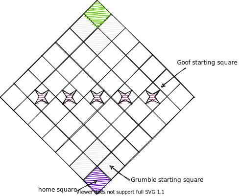
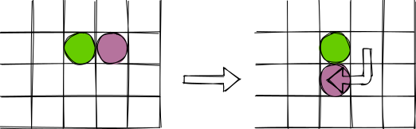

Grumbles and Goofs is a game for two players. Each player maneuvers an
ever-changing set of Grumbles to capture as many Goofs as they can before the
Goof of Doom appears. It takes just five minutes to learn the rules, and fifteen
minutes to play.

## 1. Game Parts

The game requires:

1.  A 7x7 board, marked to show each player's home corner, the three starting
    squares for each player's Grumbles, and the starting squares for the Goofs.
    A player's home corner and the three starting squares for their Grumbles are
    called their Home Zone.

2.  7 double-sided Grumbles. Each Grumble is purple on one side and green on the
    other, and is marked on both sides to show its special power.

3.  10 Goofs. Three are regular Goofs, one is the Super Goof (marked on one side
    with a star), and one is the Goof of Doom (marked on one side with a skull
    and crossbones).

## 2. Setup

1.  Decide who is going to be Purple and who is going to be Green.

2.  Turn the board so that Purple's Home Zone is near the Purple player and the
    Green's Home Zone is near the Green player.

3.  Pick 5 regular Goofs and place them on the starred squares in the center of
    the board.

4.  Place the other 5 Goofs (including the Super Goof and the Goof of Doom) to
    the side. Turn the Super Goof and Goof of Doom face down so that their
    distinguishing marks are face-down, and then stir them around so that
    neither player knows which Goof is which.

5.  Choose initial pieces.

    1.  Purple chooses one Grumble and places it on one of the three starting
        squares adjacent to their home corner, purple side up.

    2.  Green chooses one of the remaining Grumbles and places it in one of
        their starting squares, green side up.

    3.  Players continue to choose Grumbles until each player has three. The
        remaining Grumble is set aside, purple side up.

## 3. How to Play

1.  Players alternate turns. Since Purple had first choice of Grumbles, Green goes
    first.

2.  In each turn, the player can move or use each of their Grumbles once as
    described below in whatever order they want. The player does not have to
    move or use a particular Grumble, but cannot move or use one twice in the
    same turn.

3.  After they are done moving or using Grumbles, the player *must* replace one
    of their Grumbles with the unused Grumble.  This rule means that each player
    has a different set of pieces at the start of each turn.

## 4. Adding Goofs

1.  As soon as a Goof starting square becomes empty, the players must choose
    another Goof at random from the unused pile and place it on the empty square
    *without* turning it over. This means that no one knows which Goof is the
    Super Goof and which is the Goof of Doom until they get it to a home square.

## 5. Movement

1.  Pieces move across the sides of squares, never through the corners.

2.  Only one piece may occupy a square at any time.

3.  Goofs cannot be moved on their own: they can only be moved by a Grumble
    using its special power.

4.  Players may not leave any Green pieces in Purple's Home Zone or vice versa
    at the end of their turn, and may not leave any pieces of either color on
    either home corner at the end of their turn.

## 6. Special Powers

Each Grumble has a special power. These powers can be used on pieces of any
kind: the player's own, their opponent's, or the Goofs.

### 6.1. Push Grumble

When the Push Grumble moves, it can push one or more pieces that are in
front of it. It cannot push pieces off the board.

### 6.2. Pull Grumble

When the Pull Grumble moves, it can pull one or more pieces behind it.

### 6.3. Shove Grumble

After the Shove Grumble moves, it can push one piece one square away from it in
any direction. It cannot push a line of two or more pieces.

### 6.4. Yank Grumble

After the Yank Grumble moves, it can pull one piece one square toward it from
any direction.

### 6.5. Swap Grumble

Instead of moving in the regular way, the Swap Grumble can trade places with an
adjacent piece.

### 6.6. Throw Grumble

Instead of moving, the Throw Grumble can move one piece from one side of
itself to the opposite side.

### 6.7. Swing Grumble

Instead of moving, the Swing Grumble can move one piece from one side of
itself to an adjacent side.

## 7. How to Win

Players get points by moving Goofs from the center of the board to their home
square.  When a Goof is moved onto a player's home square, it is taken off the
board and turned over.

1.  If it is a normal Goof, it counts for one point.

2.  If it is the Super Goof, it counts for three points.

3.  If it is the Goof of Doom, the player who has it *loses* one point,
    and the game is over.

Whoever has the most points at the end of the game is the winner.

## 8. The Last-Chance Rule

If there is only one Goof left in play, it must be the Goof of Doom. In this
case, whoever captures it gets three points instead of losing one, just as if it
was the Super Goof.
