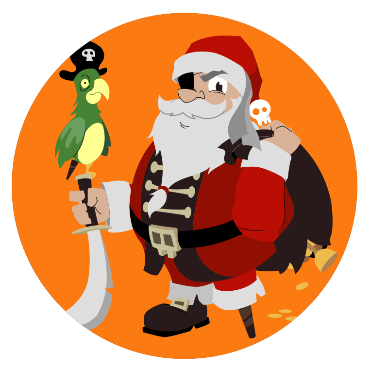
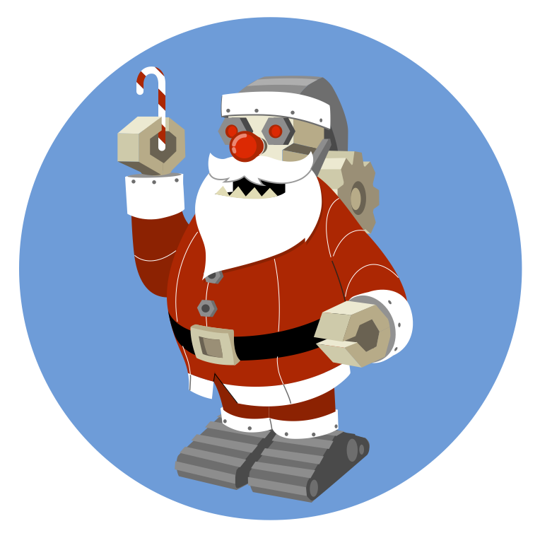
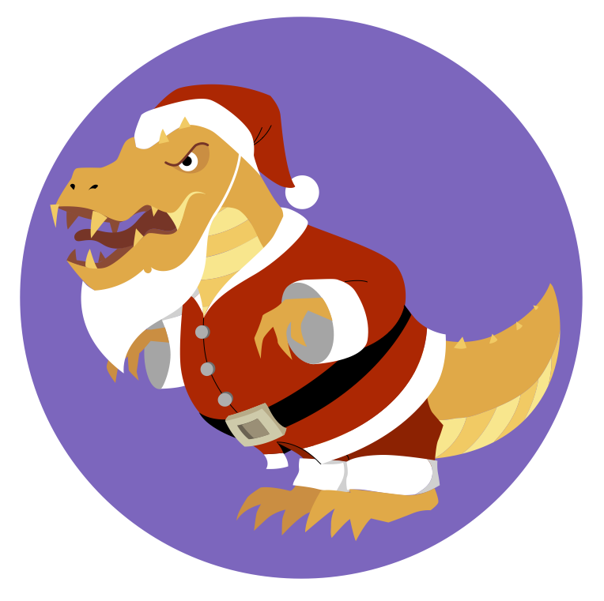
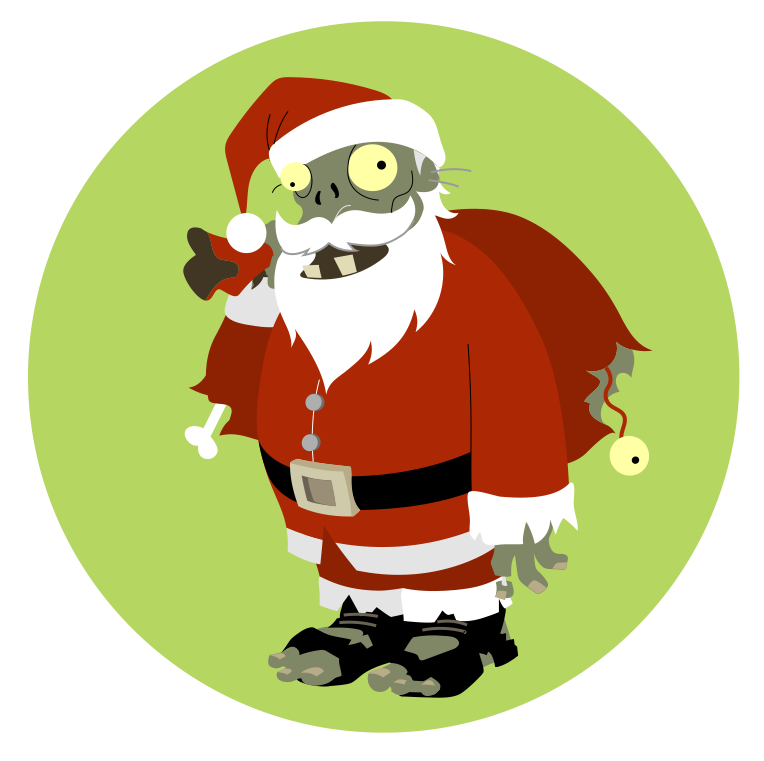

  

    

      
    

  

  

    

      
    

  

  

    

      
    

  

  

    

      
    

  

*You probably think this is a Christmas story because of the santas,
but it's not:
it's about right and wrong and figuring out who you are.
There are many footnotes and explosions but only one kiss,
and if you need someone to hold your hand during the scary bits
you're out of luck.
I'm just a book, and we don't have hands.*

<ol id="toc"></ol>

<section markdown="1">

## We Meet Our Protagonist

Once upon a time,
a young santa named Finner lived in a world halfway between yours and mine.
He came from a long line of santas and elves:
his mother had built her first wind-up wombat
when she was not much bigger than a wombat herself,
while his father started helping with deliveries
as soon as he was reliably out of diapers.[^reliably]

[^reliably]: There's a story behind that word "reliably", but it's best told some other time.

Everyone could tell that Finner was a santa the moment he was born:
his tiny little beard was the cutest they'd ever seen.
And as he grew up,
he loved santafying—at least, he tried to.
After all,
who *wouldn't* enjoy slithering down a sooty chimney
or trying to land a sleigh on a yurt without leaving a single dent in its stiff felt roof?
But no matter what he did,
a small voice in Finner's head said, "Me.
I don't enjoy this.
Or rather, I do, but it's not enough."

What he *did* enjoy was going into the workshop and helping his mother.
The smell of solder,
the *shick shick* of freshly-sharpened scissors,
and the feeling of a dovetail joint fitting perfectly together
felt right in a way that
clambering up the icy concrete side of an apartment building never did.

His parents tolerated it at first.
"Good for him to know how things are made,"
they told each other.
After a while,
though,
they began hinting that maybe he should being ho-ho-ho'ing
rather than sewing or gluing in the attic.
And a while after that,
Finner could tell that the hints were about to become
a number three talk from his father,[^number-three-talk]
so he put the tools he had borrowed from his mother back in their boxes
and pretended his dreams weren't filled with sanding and polishing.

[^number-three-talk]: Direct eye contact, patient but serious voice, lots of awkward pauses on both sides, every other sentence starting, "Your mother and I think…"

Finner became more restless every day.
His mother suggested running up and down the stairs to burn off some energy,
but that only made him sweaty.
He tried sitting cross-legged on the floor with his eyes closed
and humming softly to himself like the monks of Lotse Nuffin,[^lotse-nuffin]
but all he got was a cold bum.

[^lotse-nuffin]: The monks were his father's favorite clients. They wanted nothing, so every year that's what he took them, and they were always grateful.

There were other santas and elves in town he could have tried talking to:
aunts and uncles,
second cousins twice removed,
and a few who'd married into the trade.
But they were all related to him somehow,
which would have made the conversation awkward,
and as far as he knew they all believed what everyone else did:
elves made and santas delivered.
That's how it was,
that's how it had always been,
and that was how it was always going to be.
Any adult who even suggested otherwise was the immediate target of cold looks,
and any kid who mentioned it ran the risk of being called a flip in schoolyard.

For a while Finner wondered if he was actually just lazy,
which was basically a synonym for "sinful",
so he tried a few experiments.
Working twice as hard made him even sweatier than running up and down stairs.
Working half as hard made his father ask if he was sick and his mother mutter about teenagers.
Neither made the yearning in his chest go away.
It grew and grew until finally,
desperately,
he realized there was only one thing left for him to do.
He would have to ask his great-grandmother for advice.

As far as Finner could tell,
Gran-Granna Tumbly spent most of her time napping,
writing pamphlets about the flip menace,
or giving speeches on the same subject,
but she had been one of the greatest santas ever.
She had once delivered a chocolate orange cake to a trio of scientists in a submarine
*without using a submarine herself*,
and then delivered a baby on the way home.[^deliver-baby]

[^deliver-baby]: "Delivered" in the conventional sense of helping someone give birth rather than the postal sense used for packages. Elves did make dolls sometimes that were so lifelike normal people though they were real, and (whisper it) sometimes santas would deliver them in the dead of night when most people were sleeping and take a real child in exchange, but that's a story for another time.

Everyone was a little bit afraid of her,
except for the unfortunate few who had felt the full force of her disapproving glare:
they were a *lot* afraid.
But everyone knew that she and her wife Shady Ann had fought long and hard
to get santas the right to marry other santas
and elves the right to marry other elves.
There was a statue in the town square of Gran-Granna Tumbly and Shady Ann holding hands at their wedding,
and Finner thought that if anyone would know what to do,
she would.

He waited until Tuesday afternoon before going to see her.
The postman delivered her chocolate on Tuesdays,
and he hoped that would put her in a good mood.
*Or at least a less grumpy one,*
he thought as he trudged through the damp, clumpy snow that had fallen overnight.
The last time he had seen her had been the family gathering at Long Night.
Finner's uncle had accidentally served her camomile tea instead of double-dark coffee,
and had squirmed for an hour as she drank one slow, withering sip after another.

The Tumbly house looked exactly like the others on its street:
a front door with an evergreen wreath,
a large curtained window beside it,
and a pair of smaller windows with matching curtains on the floor above.
The downstairs window had a warm, welcoming glow,
and even from the street Finner could smell curry and freshly-baked bread.
The only notable thing was a statue of a cat sitting on a round pedestal
in the middle of the front yard,
its stone eyes fixed on a snow-filled bird bath.[^notable-yard]

[^notable-yard]: The houses on either side had a miniature Ferris wheel and a model locomotive in their front yards, so the statue wasn't really *that* notable.

Finner took a deep breath and knocked on the door.
When nothing happened he knocked again.
"So much for that," he said aloud,
secretly relieved.

"She just nipped out to get some broccoli,"
a voice rumbled behind him.
"If you don't mind waiting a moment…?"

Finner spun around.
The stone cat had turned its head toward him,
but was still keeping one eye on the empty bird bath.
"I—sure," he said lamely,
then added, "Thank you,"
because a statue of a cat is still in some sense a cat,
and one of the first lessons a santa is taught is
to always be polite to cats.

"You're welcome," the cat rumbled.

He didn't have to wait long.
A tricycle taxi rolled to a gentle stop in front of the house.
The taxi pedaller climbed out of his seat,
stretched until his spine went *pop!*,
nodded at Finner (or more likely the cat),
then opened the cab door and helped Gran-Granna Tumbly down.
Pocketing the half-coins she handed him,
he climbed back onto his seat and pedalled away.

Finner belatedly remembered that he was an able-bodied youth
and Gran-Granna was neither.
"Can I carry that for you?" he asked,
hurrying back down the short walk to the gate.

Gran-Granna Tumbly looked at the broccoli in her hand and snorted.
"I think I can manage," she said.
"Did you catch anything?"

"Uh…" Finner started, confused by the question.

"No," the cat statue rumbled.
"But I remain hopeful."

"Hmph."
Finner stepped out of the way as Gran-Granna Tumbly walked briskly up the path,
the tip of her cane stabbing the snow on every second step.
"Well, since you're here, you might as well come in."

"Yes'm," Finner said obediently.
With one last glance at the motionless cat he followed her through the door
and into the rest of his life.

</section>

<section markdown="1">

## Unexpected Guests

Finner had never actually been in Gran-Granna's house before,
but he'd heard stories.
A richly-patterned carpet in the hall that looked like it might still be able to fly: check.
A set of gargoyle coathooks: check.
A sitting room filled with a riot of greenery
and a mis-matched pair of overstuffed chairs: check.
Crossed harpoons over the fireplace and dozens of framed pictures
of children, grandchildren, great-grandchildren,
neighbors, friends, enemies,[^enemies-dates]
and the grateful, if somewhat perplexed, crew of a submarine: check.
A photograph of two middle-aged women in red-and-white coats holding hands
that must have been the inspiration for the statue of Gran-Granna Tumbly and her wife:
check,
although Finner noticed that there was an elf in the picture as well,
standing somewhat awkwardly off to the side.

[^enemies-dates]: Some of which had dates and locations written on them in neat, smug lettering.

And there was a teapot—*the* teapot,
the one people spoke about in hushed voices.
It didn't look special,
but it was never empty and its contents were never cold.
Bitter,
sometimes,
if that's what was needed,
but never cold.

Finner waited for Gran-Granna to settle into a chair
before sitting nervously on the edge of the other one.
She spooned a bit of sugar into a green-and-white teacup,
glanced at him,
added a bit more,
and then poured slowly and carefully.
"You'll want to let that cool a bit," she advised,
filling the second cup for herself
and sitting back with it cradled in her hands.

"Thank you,"
Finner said,
not knowing what else to say.
What *was* he going to say?
"Nothing feels right," was awfully vague,
and, "What should I do with my life?" seemed awfully—

"The thing about being old," Gran-Granna said without any preamble,
"Is that people think it makes you wise."

The silence that followed was broken only by
the ticking of the burl clock in the kitchen.
"Doesn't it?" Finner asked.

"Not in most cases,"
Gran-Granna sighed.
She sipped her tea,
eyes half-closed like a cat having its ears scratched.
"But it does give you a passel of stories to tell.
Take your Auncle Minglin, for example."
She gestured at a picture on the wall of someone Finner vaguely remembered
having spilled cranberry juice on a white tablecloth at some point.
"Kind heart,
and a beautiful singing voice,
but as clumsy as an ox on ice skates.
They could trip over a rock that was clear across the other side of the street."

"Not the sort to make deliveries?"
Finner ventured.

"That's certainly the conclusion they reached.
And they were pretty down in the mouth about it,
let me tell you.
The world needs doctors and airship pilots and what-not,
but when you've been told your whole life that you're destined for something else,
well,
it's hard to change direction."

Finner turned his teacup around in his hands,
wondering if his cheeks were actually hotter than the tea
or if it just felt that way.
"So what happened to them?"

"They ran off and joined the opera.
Last I heard,
they were singing six shows a week with not an empty seat in the house."
Gran-Granna Tumbly sipped her tea.
"The way I look at it,
they *did* become a santa.
They're delivering the gift of music night after night,
and that's no small thing."

"Which brings us to you," she continued,
bright eyes fixed on Finner,
who at that moment desperately regretted having come to see her
and wished he could be almost anywhere else in the world.[^geography-volcanoes]

[^geography-volcanoes]: "Almost", because he had taken geography in school and knew about volcanoes.

"Me?" Finner stammered.

"Yes, you," Gran-Granna said impatiently.
"Your parents have been worried about you for a while now.
You've been mopey and anxious
and all the other things young people get carried away with these days,
only more so."

A clock chimed quietly in the kitchen next door.
Somewhere in the distance,
someone called their children to come inside
because it was time for bed and their teeth weren't going to brush themselves.
"I just don't know what to do," Finner confessed,
angry at the tears that he was absolutely *not* going to cry.
"I like the ho-ho-ho'ing,
but—"
He paused for breath.
"It's like everyone else is excited about making deliveries and everything
but I'm just watching myself do it,
you know?
Like this is someone else's life and I've just put it on like a sweater
except it doesn't quite fit
and no matter how many times I wash it,
it'll still smell a bit like whoever it really belongs to."

"Hmph,"
Gran-Granna Tumbly snorted.
"Fancy words like that,
maybe you ought to think about delivering stories.
There are such,"
she went on.
"Places where people don't hold much by material possessions,
there are santas who memorize stories and poems
to tell to folks on their birthdays and whenever."

Finner turned his teacup around in his hands again.
"Do they write the stories too?"

Gran-Granna Tumbly shook her head firmly.
"Of course not,"
she said flatly.
She caught his eyes with hers,
which were as clear as a deep mountain lake and only half a degree warmer.
"That's making, and making is elves' work."

*THUMP!*
Finner jumped as something heavy hit the floor in the room overhead.
"What was that?"

Gran-Granna picked up her cane and struggled to her feet.
"Dearie me, look at the time," she said briskly.
"I'm sure your folks will be wondering where you are.
You'd best be—"

*THUMP!* "Ow, get off me!" a female voice said peevishly.

Finner looked at the ceiling.
"I think someone's up there," he whispered loudly.

Gran-Granna rolled her eyes.
"Door," she said, pointing at it with her cane.
"You. Through it. Now."

"Vidancia! Vidancia, where are you?"
a second voice bellowed from above.

"Quiet!" the first voice said.

"Vidanci-ulp!"
Finner practically heard someone putting their hand over someone else's mouth.

He gestured weakly toward the front door.
"I'll just, um—" he started.

Heavy boots thumped on carpeted steps
as the biggest, beardiest santa Finner had ever seen came downstairs,
wrapped his arms around Gran-Granna Tumbly in a number three hug,[^number-three-hug]
and started crying.
"Oh Vidancia," he sniffled.
"It all went wrong.
It all went *wrong*."

[^number-three-hug]: Both arms, full wrap, strong squeeze for two or three heartbeats depending on how bad things are.

Gran-Granna Tumbly wriggled out of the beard and the hug.
"Get hold of yourself,"
she ordered.
"What went wrong?"
Finner did a double take.
The santa had an ax strapped to his back,
a really big ax that looked like it was designed for chopping off heads
rather than for turning logs into kindling.

"We were ambushed,"
said a second santa
who had come silently down the stairs behind the first one.
She was no taller than Finner,
but lean where the first santa was brawny,
and her uniform—Finner did a double take.
Her hood and sack had been red and white a moment ago,
but were now changing color to match the carpet on the stairs.

Gran-Granna Tumbly pulled a handkerchief out of her sleeve
and thrust it into the big santa's hand.
"By whom?
Flips?
And what happened to your target?"

The second santa sat down heavily on the stairs.
"The target got away.
And I don't think the ones that jumped us were flips.
I think it's our other problem."
She raised her arms to put scare quotes around the word "other",
then winced.

"You're hurt," Gran-Granna said accusingly.

The second santa waved her off.
"It's nothing.
Just some broken ribs.
And maybe an eardrum.
One of my presents went off a little early,"
she added with a wicked grin.

The burly santa wiped his eyes on a sleeve that Finner could have used as a sleeping bag.
"We were all set to make the grab, and then *bam*!"
He smacked a meaty fist into an equally meaty palm.
"They were all over us.
I tried to fight 'em, Vidancia, I swear."

Gran-Granna Tumbly pursed her lips.
"That's twice they've shown up,"
she said to the second santa,
who nodded and winced before turning her gaze on Finner.

Something that felt like a mild electric shock ran down his spine
as her dark eyes locked with his.
"And who's this?" she asked.

Before anyone could answer there was another pair of thumps upstairs.
"Well," a voice buzzed a moment later.
"It's not exactly a palace, is it?"

The burly santa growled and pulled his ax off his back
with a complicated motion made fluid by practice.
The santa on the stairs struggled to her feet with a curse.
"Sorry, sensei.
They must have followed us through."

"So it appears,"
Gran-Granna Tumbly said grimly.
She twisted the head of her cane
and to Finner's absolute dumbfoundment[^dumbfoundment]
drew a slender silver rapier.
"Hold this," she ordered,
handing the bit that didn't have sharp edges to Finner,
and then everything went a little bit nuts.

[^dumbfoundment]: Yes, that really is a word.

</section>

<section markdown="1">

## Mayhem and a Pyramid

The second santa pulled a grenade out of her sack,
drew the pin with her teeth,
and chucked it overhand up the stairs.
"Bang," she said calmly.
Sure enough,
a second later there was a loud *crack!*
and bilious green foam began expanding in the stairwell.

"That won't hold them for long,"
Gran-Granna Tumbly said,
twisting at the waist until her spine made a *pop!*
only slightly quieter than the grenade's.

"Come on ya sock-chewin' deviants!" the big santa bellowed,
hefting his really quite large ax
as a UPOF[^upof] crashed through a window upstairs
and landed in the front yard with a wet *thud*.
Boots and broken glass clattered on the porch roof.
Moments later there were more thuds in the yard and a muttered,
"Ouch!
Watch where you're going."

[^upof]: Unidentified Piece of Furniture. It's like a flying saucer, except it's (usually) rectangular, doesn't fly (unless it's thrown very hard), and (normally) isn't of alien origin.

"That window *does* open," Gran-Granna Tumbly muttered.
Sparkles ran down the rapier in her hand.

"Is that a *magic* sword?" Finner breathed.

"Not magic enough," their great-grandmother snapped.
"You two! Get him out of here and keep him safe.
No, don't argue,"
she continued as the smaller santa opened her mouth.
"You're in no shape for another fight.
And you!"
She jabbed a finger at Finner.
"You go with them and you do exactly what they say, understand?"

Finner didn't have a chance to ask, "Go where?"
because at precisely that moment something roared in the front yard,
making the kind of sound that bypasses the ears
and goes directly to the bit in the back of the brain
that evolved to keep a million generations of ancestors
out of the stomachs of large predators.

"What—" a voice in the front yard started but never managed to finish.
Someone else simply screamed, briefly.
A sound like a dozen empty cans being crunched under a boot
was followed by a moment of stunned silence,
and then the shooting started.

The burly santa yanked Finner behind the blade of his enormous ax.
Bullets ricocheted off it to make lethal little holes in the pictures on the walls.
The other santa dove across the room to take shelter beside them.
Punctured in a dozen places,
the green foam in the stairs made a wet, farty noise
and began to deflate.

"Get! Out! Of! Here!" Gran-Granna Tumbly shouted.
Her sword flashed back and forth,
knocking bullets away from them.[^teapot-bullets]

[^teapot-bullets]: Or possibly from her teapot. Finner wondered about that later.

Without warning Gran-Granna's fireplace was gone,
or rather it was still there but it was also a doorway,
like one of those puzzle pictures that looks like two different things at once.
The big santa picked Finner up like a sack of laundry
and crossed the room with two enormous strides.
The universe twisted inside out and everything stretched around them
or possibly they did the stretching
and just like that they were somewhere else.

It was bright.
Very bright,
where before it had been the cozy indoor gloom of an elderly person's living room.
And there was sand, comma, lots of.
*That's a pyramid,*
a small part of Finner's brain noticed.
It was indeed a pyramid,
with half a dozen cat statues like the one in gran-granna's yard crouched in front of it.

The second santa got to her feet and brushed sand off her uniform,
which was already turning a dusty beige.
"Where are we?" she asked.

It took Finner a moment to realize she was speaking to him.
"I don't know," he said helplessly.
It was hot,
much too hot for the winter coat he was wearing.
And where was Gran-Granna?

The santa stared at him.
"What do you mean—" she started,
only to be interrupted by a voice moaning,
"Greeeetinnngs…"

Finner spun around and found himself face-to-face with—he wasn't quite sure what.
It was tall and withered
and wrapped in tattered bandages
made from the rags of what might once have been a santa's uniform.
Its eyes didn't quite line up,
and—was that a *bone* of the end of one of its arms
where there really ought to be a hand?[^mechanical-hand]

[^mechanical-hand]: A mechanical hand would have been okay. Finner had an aunt who had started wearing one after an encounter with a particularly militant guard goose, and more than a few of his mother's elvish friends had needed mechanical upgrades after what people referred to as "workshop incidents".

The burly santa hefted his ax.
"Friend or foe?" he demanded.

The mummy santa smiled, or more accurately bared its large, yellow teeth.
"That depends on…
whether you brought…
tea.
And treats…
for my pets."
At the word "treats",
one of the giant cat statues at the base of the pyramid
turned its head and blinked,
which made the "keep out of predators" part of Finner's brain go *ding ding ding!*

"Tea?" the burly santa asked,
clearly never having had this particular response to his friend-or-foe question before.

"Miz Tumbly…
always…
brings tea.
And sometimes…
a magazine?"
the mummy santa finished hopefully.

"No magazines, I'm afraid, and no tea either,"
the smaller santa said,
her uniform now a perfect match for the sand.
"We had to leave Sensei Tumbly's in rather a hurry."

"Ssss…"
The mummy hissed with disappointment.
"I suppose…
you're going…
to claim…
refuge?"

The smaller santa elbowed her burly companion's ribs to stop him from speaking.
"As is our right," she said.
"A cookie, a glass of milk, and the use of your wherever."

"Heh.
Heh.
Heh."
The mummy said the words one by one with somewhat unsettling pauses between them.
"No milk…
or cookies…
here.
Not for…
a long…
time."
The giant stone cat behind it stepped down from its pedestal.
Finner gulped as three more joined it.
Some were missing bits of ear or tail,
but the one that yawned still seemed to have a full set of very sharp teeth.
"So tell me…
why I…
should say yes?"

The smaller santa reached into her sack.
For a heartbeat Finner thought she was going to throw another foam grenade,
but instead she pulled out a head.
A toy head,
Finner noticed with relief,
with dents and scuffs and a scorch mark on one cheek.

The mummy hissed again.
"You bring…
*that*…
here!?"

The santa hefted her sack.
The cats growled as loose pieces of metal clinked against one another.
"Oh, don't be such bunnies," the santa said dismissively.
"It would take a dozen elves a week to put it back together,
and anyway,
I didn't manage to salvage a battery."
She jerked her chin at the santa with the ax.
"We were ambushed while we were on a mission for the sensei."

"They followed us back somehow,"
the big santa added grimly.
"Probably makin' a mess of her place right now."

The smaller santa shook her head.
"Sensei will be all right."
She really was hurt,
Finner realized,
but trying hard not to show it.

One of the stone cats yowled softly.
The mummy huffed.
"Let us…
hope so.
I will…
grant you…
refuge.
Follow…
me."

It turned toward the pyramid,
then hesitated.
"And…
please…
don't mind…
the mess.
I'm…
redecorating."

As they climbed the worn stone steps on the pyramid
Finner sidled over to the smaller santa.
"Can you please tell me what's going on?"

She sighed.
"The usual, I'm afraid.
We're trying to save the worlds."

</section>

<section markdown="1">

## Introductions and Further Mayhem

Zombies and mummies are similar in many ways—the shambling gait,
the moaning,
and of course the whole "undead" thing—but there are important differences.
First,
mummies are generally (ex-)royalty,
while zombies tend to have been idiots who went into the basement after dark
despite the growling and gnawing sounds
or stopped to ask, "Who?"
when someone yelled, "Look out, here they come!"

Second,
mummies are created through a complex multi-step process
during which the internal organs and the brain are removed,
packed in salt,
and stored in canopic jars.
"Which is…
just a…
fancy name…
for jars…
that hold…
someone's…
bits,"
the mummy explained as they climbed the stairs
to an entrance in the side of the pyramid
that seemed quite small compared to the pyramid
but was actually quite large.

Third,
and perhaps most importantly,
zombies devoured the brains of the living.
"Or sometimes…
their livers…"
the mummy wheezed.
"It's a…
cultural…
thing."
Mummies,
on the other hand,
were strictly vegan:
*very* strictly,
since they didn't eat at all.
"Though…
we do…
enjoy a…
nice cup…
of tea,"
the mummy added wistfully.

Two stone cats sat on their haunches at the top of the steps.
One blinked slowly as they entered the pyramid,
but other than that they might truly have been statues.
The corridor inside was wide enough for the four of them to walk side by side.
Torches guttered in sconces every few dozen strides,
making the figures painted on the walls dance.

The corridor turned into a ramp,
which turned left and left again,
each leg slightly shorter than the one before as they climbed the inside of the pyramid
"Voila,"
the mummy rasped at the top,
waving them forward proudly.

To call the chamber they entered a "room" would have been like calling the pyramid "large".
If Gran-Granna Tumbly's house had been tucked into one corner
there would still have been plenty of space for a hockey rink and a river barge.
And while there wasn't actually a hockey rink,
there *was* a barge,
along with dozens of (inanimate) statues,
a chariot,
six life-sized wooden horses,
and a small catapult.

There was also something that looked suspiciously like
a makeover of Gran-Granna Tumbly's living room.
"Please…
sit down…"
the mummy told them,
gesturing at a pair of overstuffed chairs and a blue-and-gold striped couch.
"I know…
it's not…
much…
to look at…
but…"

"Oh, it's amazing," the smaller santa said
when the mummy's pause stretched longer than usual.
"And I *love* the side tables."

"Thank you,"
the mummy said proudly.
"Here…
let me…
show you…
the original."
It pulled a magazine out of the pile on the workbench and flipped through it,
muttering under its lack of breath.
"There!
What do…
you think?"

It thrust the magazine at the smaller santa
while the burly one plopped himself down on the nearest couch,
which creaked slightly under his weight.
Finner sat hesitantly on the other
as the smaller santa agreed that of *course* you had to see it in the room
to really appreciate it,
particularly with such difficult lighting.

"Excuse me," Finner finally interrupted,
after trying and failing twice to screw up enough courage to speak.
"But can someone please tell me what's going on?
And,
um,
how I can get home?
Because I'd like to,
if that's all right."

"Probably not a good idea right now,"
the smaller santa said,
setting aside the filigree tea tray
that the mummy had casually mentioned was an antique.[^antique-living]
"I'm sure Sensei Tumbly is all right,"
she added quickly.
"But we should give her time to sort things out."

[^antique-living]: By the standards of the living, anyway.

"Why do you keep calling her 'sensei'?"
Finner asked,
instantly annoyed by the whining tone in his voice.
"And where are we,
and who are you?"

The three santas exchanged looks.
The smaller santa sighed.
"I'm Santa Hood.
This is Santa Greenwood, and…?"

"Santa Hotep,"
the mummy supplied.

"And we're in an alternate universe, right?"
Finner asked.
"I'm not stupid," he added when Santa Hood raised an eyebrow.

"We are," she confirmed.
"We're each the santa in our world.
A lot only have one,"
she added as Finner opened his mouth.

"That sounds kind of lonely,"
he said.

Santa Hood shrugged.
"It works out.
Some people think we're why all those universes exist.
Every kind of santa that can be, must be.
It's some kind of quantum thing."

"So what kind of santa are you?"
Finner asked.

She grinned wickedly.
"I'm the kind that steals presents from the rich and gives them to the poor."

Finner digested that for a moment.
"And you're the kind that chops down trees and gives everyone firewood as a gift?"
he asked Santa Greenwood.

"No,"
the burly man growled.
"My gifts are for the trees.
The ax is for anyone who tries to hurt 'em."

"I haven't…
delivered…
any gifts…
in years,"
Santa Hotep wheezed wistfully in the awkward silence that followed.
"After…
the oasis…
dried up…
they all…
moved away.
It's peaceful…
but…
I do miss…
the unwrapping…
sometimes."

Santa Hood patted the mummy's hand.
"Well, you've certainly kept yourself busy.
This place looks *amazing*."

"I have…
Miz Tumbly…
to thank…
for that."
The mummy took another magazine off a lacquered bookshelf.
"She comes…
to chat…
sometimes and…
she started…
bringing me…
these.
It was…
very kind.
I hope…
she's…
all right."
It paused.
"Or if not,"
it added reflectively,
"I hope…
Someone will…
wrap her.
It would…
be nice…
to have…
company."

"I'm sure Sensei Tumbly is fine,"
Santa Hood said,
then winced.

"Here, let me have a look at that,"
Santa Greenwood said gruffly.

Santa Hood nodded
and pulled up her coat to reveal a purpling bruise the size of Finner's hand
on her smooth, dark skin.

Finner's mouth went dry at the sight.
"I, um… Is there a…? I mean, I, um, I could really use…" he stammered.

"Of course…"
Santa Hotep waved a bandaged arm.
"Past…
the barge."

*Somewhere in the multiverse,
someone has undoubtedly devoted a book about the peculiarities of washroom facilities in ancient pyramids.
I'm not that book,
so let's just skip over the next few minutes.*

Finner closed the door carefully behind him after he finished drying his hands.
He could hear the santas talking quietly in the distance,
but seized by a sudden curiosity,
he turned left instead of right.
The horses tethered to the chariot were very life-like but just wood.
The swords and shields on display were slightly dusty but very clearly functional,
and—

He pulled up short.
There,
hidden behind a vertically-hung rug,
stood a workbench.
Carpenters' tools lay on it,
some in wooden racks but others laid out next to a trio of unfinished stool legs.
He sniffed the air.
Yes:
he could definitely smell fresh-cut wood.

"Can I help you?"
a voice rumbled behind him.

Finner spun around.
The stone cat was missing one ear but seemed to have all of its teeth,
or if not,
as many as any one creature reasonably needed.
"I, um—I was just—"

"Perhaps you should rejoin the others,"
the cat said,
its tone indicating that the "perhaps" was just politeness.

"Um, sure, of course."
Finner hesitated.
"I didn't know Santa Hotep still had elves."

"He doesn't,"
the cat said.
"Nobody has used any of this in many years."

*Then why can I smell wood?*
Finner wondered but didn't say
as he let the rug fall back in place.

"There you are,"
Santa Greenwood said as he rejoined the others.
"I was just saying we ought to get young Findlay home."

"It's Finner, actually,"
Finner corrected,
or would have if an ear-splitting yowl hadn't interrupted them.

Santa Greenwood surged to his feet at the sound,
his ax in his hands.
Santa Hotep drew a circle with its fingertip on the mirror by its elbow.
The mirror's surface rippled and reformed to show
the steps leading up to the pyramid entrance,
where the stone cats were fighting a quartet of hooded figures
wielding swords and ray guns.

"Impossible,"
Santa Hotep wheezed angrily.
"They can't—"

"They have,"
Santa Hood snapped.
"We need to get out of here *now*."

Santa Hotep nodded.
"This way."

The chamber was even larger than Finner had realized.
He froze as a statue of a hyena bared its teeth at him.
"Automated defenses,"
Santa Hood said without breaking stride.
"Pretty standard in a place like this.
I *am* a thief,"
she added over her shoulder.

Santa Hotep led them to a completely unremarkable patch of the wall.
"Left…
left…
right…
and ah…
whoopsie doo…"
it recited
as it did a slow shuffling dance.
The tiles beneath its feet went *click*.
With the slightest of scraping sounds
the stone block in front of it pivoted
to reveal another passage,
smaller and narrower than the one they had climbed
but lit by the same flickering torches.[^torches]

[^torches]: It didn't occur to Finner until much later to wonder about the torches. Were they magical everlasting torches? Or were they delivered on Tuesdays and Fridays like the cheese his father was so fond of? And why torches rather than lamps? The mummy's rags looked awfully flammable…

Up, up, up they went.
The passage cut back on itself so many times that Finner lost count.
He was just about to ask how much further they had to go
when he rounded a final bend and was almost blinded by
the bright blue square of empty sky in front of them.
That,
and the dazzling green beam of a ray gun blast.

"Jet packs," Santa Greenwood spat
"Of *course* they'd have jet packs."
He brought up his ax
just in time for the next shot to bounce off its polished blade.

"Where's the wherever?" Santa Hood demanded as the mummy caught up with them.

"Right…
in front…
of you…"
it wheezed.

"I don't see anything!" Santa Greenwood shouted,
deflecting another shot.

"Give up! You have nowhere to run!"
an amplified voice shouted from somewhere above them.

"I beg your pardon?" Santa Hood shouted back.

"I said—"

"I'm sorry, but he's not home!"
She looked at Finner and winked.
"Would you like to leave a message?"

"Just give us the wherever code to the building and we'll let you go,"
the amplified voice shouted.
"How does that sound?"

"Why don't you come here and we'll talk about it?"
Santa Greenwood bellowed.
Then he said "AAAAHHH!" in a very loud voice
because the mummy
(who was much stronger than it looked)
pushed him, Santa Hood, and Finner out into the empty air
where they fell screaming to their deaths.

</section>

<section markdown="1">

## A Last-Minute Rescue

At least,
that's what Finner expected would happen
in the heart-stopping second before the universe did the "see it both ways" trick again
and the desert was an ocean,
a beautiful blue ocean with nice soft waves instead of nasty bone-breaking solid ground.

Santa Greenwood made the biggest splash:
between his size and hitting the water in a spread-eagle bellyflop,
he actually, briefly, made a dent in the water.
Finner had only a moment to admire how Santa Hood tucked in her elbows
to plunge into the water as gracefully as a seahawk diving for fish
before discovering the hard way that it was very, very cold.

He spluttered to the surface,
thrashing his arms against the weight of his suddenly-sodden coat.
"Help!"
His boots felt like concrete blocks on his feet.

"Periwinkle!" Santa Greenwood roared.

"Working on it!" Santa Hood shouted back.
She pulled something orange out of her sack.
With a sharp *pop!* and a hiss it began to inflate.

"Be careful with your stupid ax!" she yelled at Santa Greenwood
as she tossed her sack into the newborn dinghy.

"I'm bein' careful! And it ain't stupid!" he yelled back.
A dozen powerful one-armed strokes
and he dragged himself up out of the water,
nearly flipping the dinghy over as he did so.

Finner was too busy not drowning to really notice this.
He'd managed to kick off one boot[^one-boot]
and was struggling to unbutton his coat
when Santa Hood popped up beside him like an otter and said,
"Here, let me do that."

[^one-boot]: His mother always told him to do up his laces properly so he didn't trip and break his neck. It had never occurred to him to say, "But what if I fall into another universe and need to get my boots off so I don't drown?"

Panting and kicking furiously to stay afloat,
Finner squelched his panic long enough
for Santa Hood's deft fingers to undo his buttons
and hold his sleeves so he could pull his arms free.
His coat floated away like a sad red jellyfish,
taking with it a handkerchief,[^handkerchief]
a folded piece of paper with a game of Hangman on it
left over from a particularly boring writing class at school,
and a mostly uneaten piece of toffee.

[^handkerchief]: Santas don't use kleenex. That's for wrapping presents.

Santa Hood boosted Finner into the dinghy and slithered in after him.
"Y'aright?"
Santa Greenwood asked,
wringing seawater out of his beard.

Santa Hood nodded, shivering.
"Lucky we d-d-didn't wind up in some d-d-drowned city."

"There is that.
You remember Kraken Claus?"
Santa Greenwood shook himself like a very large dog
and laid his ax across his knees,
glaring at the ocean
as if a billion liters of salt water could be intimidated.

Santa Hood hugged herself,
teeth chattering.
"Don't you have something in your sack to keep you warm?"
Finner asked,
hoping the answers would be "yes" and "I have a spare".

But Santa Hood shook her head.
"Used it a c-couple of m-missions ago."

Santa Greenwood patted her shoulder.
"Don't worry.
We're okay for now."

As if on cue,
a triangular gray fin sliced through the water beside them.
"Is there a Santa Shark?" Finner asked weakly,
hoping the answers would be "yes" and "it's actually very friendly".

"I'm af-fraid so," Santa Hood said grimly,
her teeth still chattering.
"She takes everything she c-can and never g-gives *anything* back.
Be c-careful with that!" she snapped
as Santa Greenwood hefted his ax.

"I'm bein' careful!" Santa Greenwood said,
and then three things happened more or less simultaneously:[^simultaneously]

[^simultaneously]: Whether or not things happen at the same time depends in part on who you are. If you're a helium atom, for example, you can expect to exist for billions of years, so "at the same time" includes pretty much all of human civilization.

1.  A second, larger gray fin appeared in the water beside the first.

2.  The edge of Santa Greenwood's ax nicked the dinghy's rubber gunwale.

3.  There was a sharp *crack!*
    like someone snapping a piece of wood over their knee.
    A moment later a cannonball whistled over their heads.

"Look out!" Finner shouted instinctively as:

1.  The larger gray fin changed course to head straight for them.

2.  Air began feeping[^feeping] out of the dinghy.

3.  A set of black sails appeared on the horizon.
    There was another *crack!*
    and a second cannonball splashed into the water nearby.

[^feeping]: A word that other worlds would do well to borrow. Your world's contribution would be "phlegm", which also it sounds exactly like the thing it describes.

Santa Greenwood stood up,
nearly spilling the others into the ocean.
"Come on, Periwinkle, gimme something!" he roared,
hefting his ax again.
"Chili grenades! Tangle muffins! Anything!"

"I'm out!" Santa Hood,
her arm deeper in her sack than basic physics should have allowed.[^basic-physics]

[^basic-physics]: This actually made basic physics quite uncomfortable, but nobody thought to ask it. Quantum physics would have just been, "Like, whatever."

"Look!" Finner shouted.
A ship painted the same menacing black as its sails crested the horizon.
There was an orange flash on her deck.
*Crack!*
A third cannonball hit the water between the dinghy and the circling gray fins.

"Ya gormless nabblers!" Santa Greenwood bellowed,
shaking his ax so hard that he lost his footing.
Finner grabbed the santa's belt to stop him from falling out of the dinghy
and was nearly pulled out himself.
"Why don'tcha come here an' try that, eh?"

A fourth *crack!*, another cannonball.
As the ship closed on them
Finner could see crew shouting and waving in the rigging and on the deck.
"Wait! They're not shooting at us!"
Finner exclaimed.
"They're shooting at the sharks!"

"Or they just can't aim!"
Santa Hood snapped,
her arm still deep in her sack.

And then the owner of the first gray fin decided it was now or never
and changed course toward them.
The dinghy squelch beneath Finner's bootless foot
as Santa Greenwood tried to stand up again
and Santa Hood ducked so as not to be beheaded by the ax
he actually wasn't being very careful with.
"Got it!" she said triumphantly,
pulling something out of her sack and throwing it.

There was a loud bang.
Sea water splattered all over them.
Finner's eyes immediately began itching and streaming.
"One last ch-chili bomb," Santa Hood said.

"Ahoy!" a voice called as the two gray fins turned and fled.[^sharks-flee]
"Might ye be in need of assistance?"

[^sharks-flee]: Or rather, decided quite independently of their changed circumstances that it was a good time to pursue other opportunities, because sharks never "flee".

Santa Greenwood's face fell.
"Oh, not him," he muttered.
"Anyone but him."

"Who?" Finner and Santa Hood asked simultaneously.

The black ship came up beside them.
Rope ladders were already draped over her side,
each with a sailor hanging from it with their arm out.
With a one, two, and *three* (Santa Greenwood being rather heavy)
the dinghy was left empty in the ship's wake.[^empty-dinghy]

[^empty-dinghy]: The dinghy rather appreciated having some time to itself, what with the first few minutes of its inflated existence being so full of new experiences. Then it sank, which only goes to show—something.

Finner clambered onto the deck.
Given recent events,
he was completely unsurprised to find himself face-to-face with another santa.
But what a santa:
between the eyepatch,
the skull earrings,
the peg leg,
the parrot (who had a peg leg of her own)
and the very large, very sharp cutlass in his hands,
*this* was the kind of santa that other santas dreamed of being.

"Well, ain't you the lucky ones?" the santa boomed,
a twinkle in his eye.
"Us happenin' along just now an' all.
Coulda been mighty dicey there, mighty dicey indeed."

"We were doin' all right," Santa Greenwood muttered sullenly.

"Aye, I could see that," the pirate santa said,
straight-faced.
"Ah, but where's me manners?
I'm Cap'n Clausbeard,
an' this is my crew."
He waved his sword to include the dozen figures
now standing around and behind the new arrivals,
all of whom just happened to have sharp pieces of metal in their hands.

"This is Santa Hood,"
Santa Greenwood said reluctantly.
"And Figleaf—he's Vidancia's grand-something."

"It's Finner," Finner corrected automatically,
but no-one noticed.

The pause stretched
until Santa Greenwood sighed heavily and gestured at Captain Clausbeard.
"And *this* is my dad."

"Pleased t' meet yez."
The peg-legged santa doffed his hat and bowed in Santa Hood's direction.
"The crew'll find some you some tea and dry clothes.
Got plenty o' both in the hold,"
he added expansively.

"Oh,
so you're hauling cargo now?"
Santa Greenwood muttered.

His father scowled,
and for a moment Finner could see
what Santa Greenwood was going to look like when he was older.
"It ain't cargo, it's contraband,
and there's nothin' shameful about haulin' contraband.
Why, it's practic'ly smugglin'!
And anyway,
times like these,
I figure it's every true santa's duty to—"

**FIXME: mention that other ships have been attacked**

"Tell no tales! Tell no tales!"
the parrot squawked,
nipping at the pirate's ear.

"Ow!
Avast, you pestilence,
I wasn't goin' to—"
Clausbeard swatted at the parrot,
and for a moment Finner could see
how much the pirate must have looked like Santa Greenwood in his youth.
"Anyway,
let's get you that tea."

</section>

<section markdown="1">

## Some Explanations

A short time later
Finner found himself sitting on a stool in a slightly cramped cabin
with a thick blanket wrapped around his shoulders,
a steaming mug of something made of sweetened seaweed in his hands,
and no immediate threat to his life.
Santa Hood was somewhere beneath an even larger blanket on the bunk next to him,
while Santa Greenwood had solved the problem of being too big for the furniture
by sitting on the floor.
*Deck,* Finner corrected himself.
*It's called a deck on a ship.
Which this is.*

He shook himself.
"About the whole saving the worlds thing," he ventured.
"And you mentioned flips."

Santa Greenwood swallowed a swig[^swig] of tea.
"It's what folk call other folk who are all flipped around.
Santas wanting to make things,
elves wanting to deliver—it ain't natural."

[^swig]: Which is what a "gulp" is called when you're on a ship.

A chill ran up Finner's spine
that had nothing to do with how cold he had been a few minutes ago.
"I know what flips are.
I just—
you're—"
He paused,
his brain having no idea how to finish the sentence
that his mouth had started.

"At first their were just a handful of them,"
Santa Hood's muffled voice said from under her blanket.
"After Sensei Tumbly and Shady Ann and others 
made it okay for santas to marry santas and elves to marry elves,
a few troublemakers got carried away
and started saying we should throw out all the other rules too.
Nobody took them seriously at first.
People get odd notions sometimes,
especially on worlds where they're on their own."

"Callin' 'em odd is more polite than I'd be."
Santa Greenwood scowled at the contents of his mug.
"When sensible folk wouldn't listen to their nonsense,
they just started *doing* stuff.
Santas making socks and cutlery and what-not,
elves sneaking into places they didn't belong to do deliveries…
It ain't natural."

"So what happened?"
Finner asked,
looking into his tea so that he didn't have to make eye contact.

"Turned out a lot more people agreed with them than anyone thought,"
Santa Hood said wearily.
"Or didn't exactly agree with them but figured it was none of their business
or they didn't have a right to say it was wrong.
Sensei Tumbly was one of the few who did."

Santa Greenwood nodded.
"Cost Vidancia a lot of friends.
Folk that stood with her and Shady Ann when they were marching and writing letters
and getting themselves arrested—turned out a lot of them were okay with this nonsense."
He shook his head.
"It's disrespectful, is what it is, after all Vidancia's done."

"Who's being disrespectful?" boomed Captain Clausbeard,
who had just opened the cabin door without bothering to knock.
His parrot squawked something in his ear.
"Ah. Right. Them.
Anyway, what's it like bein' back in your old cabin, eh, lad?
Must bring back memories, eh?"

Santa Hood raised an eyebrow.
"This was *your* cabin?"

Santa Greenwood muttered something that might have been "yes".
Santa Hood jerked her chin at a pencil drawing of a tropical island
nailed up beside the cabin's single round porthole.
"I didn't know you were so artistic."

"Oh, he was a wizard with all that stuff,"
Captain Clausbeard said proudly.
"An' even better at crochet.
Why, I still have a couple of doilies that—"

"I *think*," Santa Greenwood interrupted,
"I think we oughta focus on the problem at hand, don't you?
Namely how we're going to get Fiddler—"

"Finner."

"—back where he belongs
and what in the name of rain we're going to do about these,
these *troublemakers*,
because I for one have had *enough*!"
He thumped his meaty fist on the deck,
making Captain Clausbeard's parrot[^parrot] squawk.
"First it's the flips,
then it's this new lot—it's troublesome,
is what it is.
Troublesome!"

[^parrot]: The parrot would have been somewhat offended by this phrasing, as she thought of the captain as being hers. Luckily for me, the parrot found turning pages so difficult that she never bothered to read books.

Whatever the captain might have said in reply
was cut off by a cry from the crow's nest.
"Cap'n!
We got somethin' on the horizon!
North by nor'west,
a hundred fathoms up an' headed our way!"

The humor dropped from Captain Clausbeard's face like spilled porridge.
"Well, lad, are ye fit to fight?" he asked.

"Fit enough."
Santa Greenwood clambered to his feet,
swearing as his head hit the ceiling.

Captain Clausbeard nodded.
"Glad t' hear it.
Your friends can stay here 'til we know whether we're eatin' peaches or pickles.
That's an order," he added as Santa Hood opened her mouth.

"Yes, cap'n," she said neutrally.

Captain Clausbeard grinned and doffed his hat again before stomping out,
his peg leg thumping on the deck.
"Avast, ye scallywags!" he bellowed.
The door closed behind him.

Santa Greenwood hefted his ax.
"Don't worry about us,"
Santa Hood told him,
wriggling a bit to free herself from her blanket's embrace.
"We'll be safe in here.
Besides, I'm not done studying this masterpiece of yours."

Finner expected Santa Greenwood to scowl or make a joke.
Instead, he spoke without looking at either of them.
"That's Isla del Tesoro.
It was my first forest.
More of a broadleaf basal jungle,
really,
but there were trees big as masts with great beards o' moss hangin' off them,
and orchids an' ferns an' all sorts.
The rest o' the crew didn't like it—they all got itchy
as soon as they were out of earshot o' the waves,
but you could walk for hours an' see nothin' that wasn't green.
First time I spent the night there felt like comin' home.
Drawin' that picture felt like makin' myself a promise.
Kinda surprised my dad left it up,
what with all the arguin' we did when I told him I was set on becomin' a landlubber."
He paused.
"He came 'round eventually, though.
Glad for that."

For a long moment the only sounds were the creaking of the ship's timbers
and muffled shouts from the crew.
"We'll be safe in here,"
Santa Hood repeated,
her voice as quiet as Santa Greenwood's had become.

Santa Greenwood nodded,
yanked the door open,
swore as his forehead hit the lintel,
and closed the door behind him.
Santa Hood rolled her head to work out a kind in her neck.
"So," she said conversationally,
letting the blanket slide down so that Finner could see the ray gun aimed at his chest.
"How about you tell me who and what you really are?"

</section>

<section markdown="1">

## An Airborne Attack

Finner's hands put themselves up.[^hands-up]
"I'm Finner!" he exclaimed.
"Finner Tumbly!"

[^hands-up]: Whic is more accurate than saying "he raised his hands" because his brain wasn't involved in the process.

"Uh huh.
And I suppose you want me to believe that
you just happened to be in sensei's house when those robots followed through the wherever?"

Finner's mouth worked.
"Robots?" he finally managed to get out.
"I don't know anything about robots!
And I don't know why you call my gran-granna 'sensei',
or any of this!
I just want to go *home*."

Santa Hood pressed a button on the ray gun with her thumb.
It hummed threateningly in response.
"You're not going anywhere until I'm sure you're not a robot yourself."

"What!?
I'm not a robot!"

"Uh uh uh."
Santa Hood gestured with the gun.
Finner's hands shot back into the air.
"Better.
I said,
prove to me that you're not a robot.
Because you were gone an awfully long time at Santa Hotep's.
They could have replaced you then."

For a moment Finner just gaped at her.
*You could check my pulse,* he thought,
immediately squashing the idea
back into the corner of his brain where he kept all the other troubling thoughts
he had about women, comma, attractive.
"I'm bleeding," he blurted.
"I mean, just a bit, but I scraped my arm.
I can…?"

Santa Hood nodded permission.
Arms still in the air,
Finner pulled his right sleeve down to his elbow.
"See?" he said hopefully.
It wasn't actually much of a scratch,
but it was red and yay,
there was in fact a small splotch on his skin.

Santa Hood studied it a moment,
then pressed the button the ray gun again.
With a disappointed *mmrrrmmm*
the end of the gun dimmed and blinked out.
"Sorry about that,
but you can't be too careful.
Here, take it."
She leaned forward to pass it to him and winced.

Finner put it on the tiny desk he'd been sitting beside.
"How are your ribs?" he asked sulkily.

Santa Hood shook her head.
"I've had worse.
You don't learn to make the kinds of presents I make
without getting a few bumps and bruises.
Your gran-granna taught me that.
That's why I call her sensei," she added.
"She taught me a lot of things,
and I'd do anything for her."

Finner nodded slowly.
The stone cat in Gran-Granna's front yard,
her magic sword:
even without all of that,
the idea of that particular little old lady knowing enough to teach those particular skills
was perfectly in character.

A hundred questions about robots and replacements whirled in his head.
What he asked instead was,
"Can I do anything?"

Santa Hood snorted, which made her wince again.
"A cup of actual tea would be nice,
but I think we'd both better stay down here for now.
Wake me up if anything exciting happens."

A few moments later she was snoring gently beneath her pile of blankets.
Finner put his head down on the little desk and tried to fall asleep as well,
but the rock and sway of the ship made his stomach flip-flop
every time he closed his eyes.
Finally he sat up,
rolled his head from side to side to get a kink out of his neck,
and picked up the ray gun Santa Hood had given him.

It looked like a well-made toy with its gnurled grip and shiny barrel,
but was heavy in a way that said,
"No, I can actually make holes in things."
He pointed it at the porthole,
closed one eye,
and said, "Blam!"

A brilliant green beam of light blasted the glass right out of the porthole.
Finner gaped,
still feeling the hum of the shot in his hand,
then tossed the ray gun onto the desk as if it had just bitten him.

"Wuzza?" Santa Hood grunted in her sleep.
Finner held his breath until she rolled over under blankets
and started snoring again.
The ray gun just lay there the whole time
like an unopened note for his parents from his writing teacher.[^writing-teacher]

[^writing-teacher]: The first time Finner had to bring home a note from that teacher, his parents let it sit on the dinner table *until dinner* before opening it. They didn't mention it or even look at it until then, which of course meant Finner couldn't think about anything else. It turned out to be a reminder about an overdue book addressed to another student, which left Finner feeling somehow cheated out of a calamity.

"Right," Finner muttered under his breath.
He picked up the ray run gingerly with just his thumb and one finger.
The porthole was definitely glassless.
He brightened slightly.
Maybe instead of just being baggage he could actually help Santa Hood.
*And Santa Greenwood too, of course,* he added hastily in his head.
For a moment he saw himself standing beside her—er, them,
blasting away with the ray gun while his new-found teammates tossed their grenades
and waved their ax menacingly.
Maybe he could even—

*Crack!*
*Crack!*
The ship shuddered beneath his feet as the cannons above him fired.
Shouts rang on the deck outside the cabin.
"Wuzza!?" Santa Hood grunted again, sitting up.
"Wuz g'non?"

"Stay here," Finner said firmly.
He tucked the ray gun into his trousers,
then imagined what would happen if it went off again
and transferred it to his pocket
as he pulled the cabin door open
and stepped out into chaos.

Half a dozen sailors were firing rifles and complicated crossbow-ish things into the air.
Others were reloading the ship's cannons
as Captain Clausbeard and his parrot[^parrot-time] bellowed orders.
In between them,
Santa Greenbeard was hacking at an enormous black tentacle with his ax.
No, not a tentacle—it was a metal cable as thick as Finner's arm
dangling from the blue-and-gray airship that now floated above the ship.

[^parrot-time]: Sorry, sorry—the parrot that usually chose to spend time with the captain.

A second cable dropped from the airship as Finner gaped up into the sky,
then a third.
The sailors' bullets and arrow-ish things had no more effect on the airship
than Santa Greenwood's ax had on the cable.
"Stand by to repel boarders, ye grumble-fisted knucklewaddlers!"
Captain Clausbeard shouted,
drawing his cutlass and passing a tiny replica of it to the parrot,
who clutched its sliver-sized blade in her beak.

*Crack!*
*Crack!*
The cannons fired again.
Something thunked into the deck a few steps away from Finner
and began spewing smoke.
The cable snagged on a hatch and went taut.
*Snap!*
Finner ducked as the hatch flew through the air
and splashed into the ocean.

Someone yelled,
"Here they come, cap'n!"
as half a dozen elves and santas slid down the cable.
*Thump!* *Thump!* *Thump!*
The first three hit the deck
and rolled to their feet with swords in their hands.

"Get on the blasted radio and get me some blasted air support!"
Clausbeard roared at the nearest pirate.
"The rest o' you—hold 'em off 'til the flyers get here!"

Steel rang against steel.
Captain Clausbeard and his crew pressed hard against the attackers.
For a moment it looked like the fight would be over as quickly as it had begun,
but more boarders were sliding down the cables into the ship's rigging.

"Away wi' ye!" Santa Greenbeard bellowed.
With one might swing of his ax
he sent two elves flying over the gunwale.[^gunwale-sharks]
His backswing snapped a santa's sword in half.
He raised the ax over his head,
took aim—

[^gunwale-sharks]: Which made the sharks very, very happy.

—and froze as a dart the length of Finner's thumb
sprouted from the side of his neck.
"Oh drat," he said weakly.
The ax slid out of his hands.
He fell to his knees,
his hand reaching for the dart as his eyes unfocused.

Finner spun around.
An elf dressed in black hung in the rigging of the foresail,
a blowgun in der hand.
De caught Finner's eye and grinned
as de pulled another dart from the pouch on der belt
and put it between der teeth.
De raised the blowgun to der lips and took aim.

Afterward,
Finner could never remember actually drawing the ray gun.
It was just suddenly there in his hand.
A single brilliant bolt of green punched a smoldering hole in the foresail
an inch from the elf's head.
"Bwah!?" the elf tried to say,
then, "Uh oh."
De glared accusingly at Finner,
spat out the dart de had just swallowed,
and sagged in the rigging like a straw doll
hanging forgotten in a tired child's hand.

Finner didn't let himself think.
Instead,
he spun around,
firing again and again.
His shots went wild,
but all of a sudden it was no longer
just the boarders versus the pirates.
It was the boarders versus the pirates and *him*.

"Their ship!
Blast their blasted ship, you blasted idiot!"
Captain Clausbeard shouted.
Finner pointed the ray gun into the air,
squinted,
and pulled the trigger—

—just as the deck swayed beneath him.
His shot went wide.
He took aim again,
flexing his knees in time with the ship's roll and heave,
and—

"Oh."
His hand flew to his neck.
There was something there.
There was—wait,
did he have a dirty gym sock[^gym-sock] in his mouth?
It sure felt like he did.
Tasted like it, too.
He turned his head sloooowly
and blinked at a second black-clad elf holding a blowgun,
and then everything went away,
including him.

[^gym-sock]: The particular sock he was thinking of had belonged to a classmate of his whose idea of "funny" was sneaking up behind people and stuffing a sock or a mitten in their mouth. He was eventually eaten by a crocodile while trying to win an ill-considered dare. Nobody really missed him except his parents, and even they were secretly a little relieved.

</section>

<section markdown="1">

## Captain Snood

When Finner was next aware of his own existence,
his head was several feet away from his body.
At least,
that's how he felt until he scrunched up his eyes
and opened them again to discover that
he was in fact lying on a padded table of some kind
in what looked like an operating room.
His mouth no longer tasted like a gym sock,
but his tongue still seemed much larger than usual,
and the straps around his wrists and ankles
were just a little too tight to be comfortable.

His brain paused and reversed
like a driver noticing an overlooked parking spot.
Straps?
Why was he strapped down in what looked like an operating room?
Half a dozen possible explanations raced through his mind,
each less pleasant than the one before.

He was wondering if he should call for help
or hope that his captors had forgotten him
when the door near his feet slid open.
A short, plump santa wearing a white coat and a matching white mask stepped into the room,
exclaimed,
"You're awake!"
and fled.

"Hello?" Finner said.
"Could someone please—um, could someone please let me up?
I'd like to go to the bathroom."

The door slid open again.
The elf who entered this time was taller than the santa
and wore a blue uniform instead of a lab coat.
The ray gun in her hand was a twin of the one Finner had fired,
except hers had several tally marks scratched on the barrel
and was pointed at Finner.

"All right," she scowled,
"You have thirty seconds to convince me that we shouldn't just pitch you over the side."

"I—"
*I just want to go home,* he finished in his head,
but what he said out loud was,
"I really do need to go to the bathroom.
Please."

The elf scowled a moment longer,
then turned her head slightly.
"Undo him," she ordered the santa without taking her eyes off Finner.
She held the ray gun steady as the santa nervously unbuckled the straps holding Finner down.

He sat up and rubbed his wrists.
The elf waggled her ray gun toward the door.
"Third one on the right," she said curtly.
"And don't try anything funny."[^try-funny]

[^try-funny]: She probably didn't mean, "Don't try stuffing a sock in my mouth," but we'll never know.

"To the right" was a narrow corridor with painted metal walls and a rubberized floor.
Flat strips set into the ceiling cast orange light
on doors like the one that slid closed behind them,
each with a number and a cryptic legend like "Aux. Batt." stenciled on it.
Finner fumbled with the bathroom's handle,
then sighed with relief at the sight of a perfectly normal toilet and sink.

"I'll be right here," the elf warned,
leaning back against the opposite wall and crossing her arms.
Finner nodded and slid the door shut.

*I've been telling this story more or less as it happened
because that's what books are supposed to do.
I haven't bothered with details
like the number of sails on Captain Clausbeard's ship (seven)
because they didn't seem important.
The two and a half minutes that Finner spent in the bathroom matter even less,
so let's just skip ahead to the moment after he washed his hands.*

Finner slid the door open.
The elf hadn't shifted,
and neither had her scowl,
but her ray gun was holstered on her hip instead of in her hand.
"Let's go," she ordered,
nodding to show the way.
"And remember, don't try anything—damn, why do they always run?"
Because of course that's what Finner did.

His boots thumped on the rubberized floor as he pelted down the corridor.
The first door he tried was locked.
So was the second,[^second-door]
but the handle of the third turned and clicked.
He ducked in and pulled the door closed behind him as quietly as he could.

[^second-door]: Which is why he never got to find out what "BCB RNV" meant, or why there was a hand-lettered note below the title reminding readers to make sure their next-of-kin form was up to date before entering.

The room was completely dark.
Finner patted the wall next to the door
until he found a switch,
then hesitated.
It might be a light,
but it might also—he wasn't quite sure what,
but given how things had been doing,
"alarm" and "incinerator" both seemed possible.
Instead,
he pressed his ear to the door
and listened for sounds of pursuit.
There was nothing except his own breathing
and the deep *thrum thrum thrum* of distant motors.

He put his back against the wall and slid down to the floor.
"Well," he said,
then hugged his knees and pressed his face into them.
He had no idea where he was,
but he was hungry
and he just wanted to go home and be miserable there.

The moment passed,
as such moments always do.
He wiped his face on his trousers,
got to his feet,
and flipped the switch.

Four light strips in the ceiling came to life
to show Finner a room like the one he had woken up in.
Instead of an operating table it had a desk,
and the walls were filled with filing cabinets.
Each drawer had a picture on it of a santa or an elf.
Some were photographs,
some were drawings,
and others sparkled slightly and tracked Finner with their eyes.
There were nametags below the pictures,
each with a date and a six-letter code of some sort.

The door opened behind him.
He whirled around.
The elf he had run away from looked at him with just a touch of annoyance on her face.
"How about you come with me?"
she suggested.

Ninety seconds and three corners later,
the corridor brought them to a short ladder with rungs polished by frequent use.
Finner clambered up it into the murmur and bustle of
the bridge of a airship in flight.
The front window was made of hexagonal glass panels
held together by thin strips of brass.
The walls to either side were filled with instruments and controls.
Santas and elves in blue uniforms paced back and forth beside them,
adjusting dials and jotting notes on clipboards.
A uniformed elf stood facing the enormous window
with her hands clasped behind her back.
Her straight back and the cutlass at her side practically shouted "captain".

"Alpha Two reporting with salvage in tow,"
the elf behind Finner reported crisply.

"Thank you," the captain said without turning.
"Dismissed."

Alpha Two hesitated.
"Ma'am—"

"I'm sure it will be all right,"
the captain said.
"If he was going to explode, he would have done so by now."

"Yes, ma'am."
Alpha Two saluted, turned, and slid back down the ladder.

"Um, excuse me," Finner started,
then stopped as the captain put her hand on the hilt of her cutlass
and turned around.
She was taller than Gran-Granna Tumbly and didn't have nearly as many wrinkles on her face,[^wrinkles-face]
and she was clearly an elf rather than a santa,
but she gave off the same feeling of being an irresistible force in search of an immovable object.

[^wrinkles-face]: Old people don't actually have more wrinkles than young ones: young people's skin just hasn't had enough practice wrinkling to do it all the time. By the time you have smiled or frowned as often as someone like Gran-Granna Tumbly, your wrinkles are like a weight lifter's biceps. Some cultures regard strongly-defined wrinkles as a sign of virtue, and have specialized gyms where people wiggle their eyebrows or smirk over and over while a personal trainer urges them on.

"Captain Snood, at your service," the elf said in a clipped voice.
"And you must be Finbar."

"It's Finner,"
Finner corrected automatically.

"Finner," the captain repeated.
"I'll keep that in mind.
So what were you doing on board the *Dancing Marmot*
and how did you come by this?"
She pulled Santa Hood's ray gun out of one of the voluminous pockets of her overcoat.

"Um."
Finner cleared his throat.
"If the *Dancing Marmot* is the ship I was just on,
they rescued us from sharks because our dinghy was sinking.
And I got that from one of the santas I was with.
I think she got it from one of the elves who was shooting at us
when we were,
um,
earlier.
I hope I didn't hurt anyone,"
he added hurriedly,
thinking of the glass that wasn't in the porthole of Santa Greenwood's old cabin any longer.

"If hope was soup we'd never go hungry,"
the captain said evenly.
"You put one of my crew in the infirmary with a rather nasty burn,
though the doctor says de'll be fine."

"I'm sorry,"
Finner said contritely.
"I thought you were attacking us and I wanted to help."

"We were, and unfortunately you did.
The *Marmot* got away,
which means you've put dozens or even hundreds of people at risk."

"I'm sorry,"
Finner repeated miserably.

The bridge crew glanced at them but didn't interfere.
Flying is tricky even in the best of circumstances,
and if Finner had been paying attention
he would have heard quiet murmurs about
damage control crews reporting hull breaches
and steering vanes needing in-flight repairs.
The skirmish with Captain Clausbeard's ship had only been
the equivalent of two cats taking swipes at one another
and then pretending each other didn't exist,
but airships are fragile things.

"Number two stabilizer is back in action, captain,"
an elf called out from a control panel to Finner's left.

"Thank you, Alpha Nine,"
the captain said without taking her eyes off Finner's face.
"Have the crew start work on the vents next."

"Aye aye, captain."

Captain Snood studied Finner a moment longer.
"Let me save us some time,"
she said as he opened his mouth.
"You're Tumbly's great-grandson and I am her nemesis.
Or one of them, actually—she's the sort of person who collects nemeses.
She thinks elves ought to sit in dingy basements folding paper,
but all I ever wanted was *this*."
Her gesture took in her cutlass, the bridge, the airship, and all the infinite worlds.
"If it wasn't for her lot,
we'd be delivering some of the best presents the worlds have ever seen.
As it is…"
She left the sentence unfinished.

"So—so you're a flip?"
Finner asked.

The captain looked at him with absolutely no expression.[^absolute-expression]
"That's not a word we use on this ship," she said levelly.
"Alpha Seven?"

[^absolute-expression]: In the sense of "absolute zero".

A nearby elf saluted.
"Yes, captain."

"Remove him from the bridge.
Find someone from Beta watch who has annoyed me recently
and tell them to keep him out of trouble."

A few moments later Finner was back at the bottom of the ladder.
"That way,"
Alpha Seven told him, pointing.
They had only gone three steps when an alarm began to blare
and the overhead lights changed from orange to red.
"All hands, all hands, battle stations!"
a crackly voice ordered through unseen speakers.
"Battery teams to firing stations!
Fire suppression teams, suit up!
This is not a drill!"

"Look!" Finner shouted.
Alpha Seven spun around.
In the moment it took the elf to realize de had been tricked,
Finner ran.

</section>

<section markdown="1">

## I Like to Fix Things

*I'm getting pretty good at this,* he thought giddily
as he half-slid, half-bounced around a corner.
There!
Door number one oh six, "Emerg Whvr".
He twisted the handle,
pulled it aside,
stubbed his toe on the sill as he stepped through,
and slid the door shut behind him.
*Snick!*
He hoped that was a lock.
Even more,
he hoped he wouldn't be here long enough to find out if it wasn't.

The room was smaller than the one he'd woken up in.
There was no furniture and no window,
just a line drawing of an archway on one whitewashed wall
with a pair of heavy brass dials beside it.
Codes were stencilled on the wall beside it:
"QCD 143.7 22.8",
"NAR 96.0 533.5"…
The last one was "OVB".
The numbers had been crossed out
and the words "We miss you Alpha Five" written in their place.

"Hey!"
A fist banged on the door.
"Open up!
Open up *now*!"

"Just a miiinuuute,"
Finner sang.
The codes had to stand for places,
and the numbers had to be how to set the dials to get to them,
but how was he supposed to know where "QCD" or "NAR" were
or whether they were safe to go to,
because he was pretty sure "OVB" wasn't.

"Last chance!" Alpha Seven bellowed.
"Either you open this door or I zap it open!"

Finner said a word he was pretty sure his parents thought he still didn't know.
If he picked a world at random
he could wind up on the moon without a spacesuit
or sitting on an ice floe wondering if the cold or Santa Kraken
would get to him first.

His shoulders slumped.
Better to be a prisoner than a meal.
"All right, I give up," he said,
or would have if a loud *boom!* hadn't shaken the airship
hard enough to knock Finner right off his feet.
The whole room—in fact, the whole airship—tilted to one side.

As Finner fell forward
his left hand hit one of the dials.
The light above his head flashed,
or maybe that just a side effect of him stretching in one impossible direction
while the universe stretched around him in another.

A moment later the lock sizzled and evaporated.
Alpha Seven slid the door open,
looked despondently at the empty room,
and used exactly the same word Finner had used moments before.

</section>

<section markdown="1">

## Cold That Seeps Into Your Soul

You have probably been cold at some point in your life.
Maybe you wriggled out from under your blanket as a baby
and weren't yet able to wriggle back underneath it.
Maybe you didn't realize that someone else in the house liked cold showers
and turned on the water *while you were already standing there*
and were blasted with the last few seconds of that previous person's liquid self-loathing.
Or perhaps you have had to endure the kind of bone-deep chill of being poor in winter,
of not being able to afford to turn up the heat during the day
or to buy a coat that's thick enough to keep out the wind.
That kind of cold is the worst:
it seeps into your soul as well as your body
because you lose hope of it ever ending.

Thirty seconds after whumping
into a snowbank somewhere very Arctic,
Finner felt even colder than that.
The sky above him was an impossibly clear blue
and the sun was so bright he couldn't even look *near* it,
but each time he took a breath
he could feel the air going into every little corner of his lungs.
Tiny icicles had formed in his nostrils,
and his beard crackled each time he squinted.

The snow squeaked beneath his boots with every step.
Basic survival training is part of every santa's education,
so Finner knew that if he just stood still and shivered,
he wouldn't shiver for long.
He had no idea where he was going,
or even if there was a "where" to go to,
but he had to keep moving.

He struggled up to the top of yet another shallow ridge
and rubbed his eyes with fingers he could no longer feel properly.
Were there icicles in his eyelashes?
That wasn't important.
What mattered was that he could see something large, dark, and rectangular on the horizon.
A factory, a lab, a fortress:
as long as it wasn't ice,
it was something to aim for.
He stumbled toward it,
hugging himself to keep in what little body heat he had left.

When he reached the top of the next ridge
he had to stop and rub his eyes again.
An enormous factory sat in the shallow valley in front of him.
Finner could have stacked ten copies of his house on top of one another
and still not reached its steeply-slanted roof.
Turrets and towers,
windows of all shapes and sizes,
and steam—steam!—rising from chimneys.

He was about to start down the ridge
when one of the turrets turned its head and blinked.
Three people could have sat side by side between its eyes,
and its saber-sharp teeth were as long as Finner was tall.
The tattered remnants of its red vest were almost gray with grime and age.

Finner ducked behind the ridge line.
The creature was a *santasaurus rex*,
but twice the size of any he'd ever heard of,
and it was between him and his only hope of not freezing.

"Well that's a problem,"
a voice said.
"Whatever shall we do?"

Finner turned around slowly.
The elf standing there was wearing a carefully-patched green coat and a tasselled hat.
Its steel body and cheery painted face was scratched and dented,
but the ray gun it was pointing at Finner looked brand new.

Finner raised his hands.
"I g-g-give up," he chattered miserably.

The robot's lightbulb eyes blinked on and off rapidly.
"Oh dear.
Are you organic?
That's rather a poor choice in *this* climate."
It tucked the ray gun into a pocket and held out its hand.
"Come along.
Let's get you somewhere warm."

The robot's feet were flat round pads that left shallow circular dents in the top of the snow.
After stopping several times for Finner could catch up,
it picked him up and carried him.
Finner would have protested, but he was too tired to more than mumble.
His ears had stopped hurting.
He was pretty sure that was a bad sign.
Why was he trying to keep his eyes open?
He knew it was important in a distantly theoretical kind of way.
Maybe he would remember when he woke up…

The next thing he remembered, everything hurt.
His ears, his toes, his back, his throat—his whole body
wanted him to know it was annoyed.
He was lying beneath a heavy pile of scratchy blankets,
and a quick, furtive inspection confirmed that yes,
he was naked.
Warm and not dead,
but someone had undressed him while he was unconscious.

He sat up,
clutching the blankets to his chest.
He had been lying on a bench whose vinyl cushions were flaking with age
in a room that looked like an abandoned subway station.
with cracked floor tiles and a truly memorable bouquet
that was equal parts damp earth, oily rust, and wet dog,
the last of which was coming from the blankets.
Two square glass panels connected to a boxy battery
cast a gloomy blue light over crates, boxes, sacks, and bags,
each one overflowing with broken toys,
salvaged pieces of clothing,
and kitchen implements still in their immaculate plastic packaging.

"Ah, good, you're awake."
Finner twisted around at the sound of the robot elf's voice.
"I've made you some tea."

"Where am I?
What happened here?"
Finner asked,
gingerly taking the mug the robot offered him
and then doing a double-take.
The robot elf wasn't a robot.
In fact, it wasn't even an elf.
She was a santa,
and very much alive,
though the years on her face made her look
as battered and worn as the subway station.

The santa tsk'ed.
"People, that's what happened.
People who never felt they had enough no matter how many presents they got.
It all turned into ray guns and speeches and explosions.
How's the tea?"

"Fine," Finner said automatically,
by which he meant "warm".
"But if you don't mind, where *am* I?"

The santa patted Finner's shoulder.
"Get dressed and I'll show you."

Finner was *not* excited about going deeper into the derelict subway tunnel,
but when the santa picked up the light panels and strode away,
it was either that or sit in the dark
and listen to the ceiling drip.

The santa waited patiently for him in front of a heavy metal door
as he picked his way around the piles of salvage.
"Here," she said,
passing a light to Finner.
She punched a code into the panel beside the door,
turned a key in a lock,
turned a second key in another lock,
and swung the door open.

"Wow," Finner said.
The workroom in front of him was as clean as the subway behind him wasn't.
A double dozen workbenches lined the walls,
each one bearing lathes, saws, drills, and shelves of spare parts.
Cans of paint and oil were stacked neatly between them,
but he didn't see any of that,
not at first,
because standing in the center of the room was a red and white subway train.

The santa coughed.
"It's something, isn't it?" she said quietly.

Finner nodded.
The engine was decorated with silver bells
and had a small silver snowman as a crest.
Green enameled holly leaves ran up the sides of the three cars behind it.
It was so beautiful that he almost didn't notice the scrapes and scratches,
the scorch marks from ray gun fire,
and the sheets of plastic taped up where windows had once been.

"It's the last of its kind," the santa said.
"Or it will be when I get it working.
See?"

She nudged Finner over to the nearest workbench.
Books and manuals lay on top of it,
some with scraps of paper tucked into them as placeholders.
Finner picked up one of the books.
*Mechanical Motors Part XVII: Reciprocating Drives* was stamped on the cover.
Inside were diagrams so detailed he would have needed a magnifying glass to make sense of them
and dense blocks of text interrupted by formulas and tables.
"Are you repairing it yourself?"

The santa nodded.
"There was a school three stops up the line before everything fell apart.
Took a while,
but I managed to sneak past Santazilla and find these.
Elfabot's helping,"
she added.
"In fact,
its doing most of the work.
But I'm learning."

Finner paused for a moment to consider his words.
"Do santas normally do this kind of work in your world?"
he finally ventured.

The santa shrugged.
"This isn't actually my world.
But santa this, elf that—it all seems pretty foolish when everything has fallen apart.
I think what matters is whether people are happy or not.
All I know is that if we can fix the train and deliver some presents,
the world will be a better place."

She straightened some tools on the workbench nearest her.
"Now, tell me about you.
How did you wind up here?"

Finner put down *Mechanical Motors Part XVII*.
He didn't want to lie,
but after everything he had been through,
the whole truth seemed ill-advised.
"By accident," he confessed.
"I was fooling around with a wherever and set it off by mistake.
So if I could just use yours to get home, I'd really appreciate it."

"I'm afraid that will be rather difficult,"
the Elfabot said,
poking its head out from behind the train's engine.
"You see,
the only one left in this world is in the factory that Santazilla is guarding."

</section>

<section markdown="1">

## A Train Ride

Here's a fun fact:
if you eat nothing but cold tinned beans for a week,
you don't actually learn to appreciate either their taste or their texture.
Here's another:
hot showers are possibly the greatest thing ever invented,
particularly if you're only allowed one a day and it only lasts three minutes.

And here's a third:
joy can be found at the strangest of times and in the most unlikely places.
Finner knew his parents must be worried sick about him,
and he missed his friends and sleeping on a mattress instead of on a bench,
but the next few days were as happy as any he could remember.
Though when he thought about it
(which he did every night as he tried to get comfortable on his bench),
"happy" was the wrong word.
"Rewarding" or "fulfilling" would be more accurate.
Despite her protests that she was still learning,
the santa knew a *lot* about mending and fixing things.
She also knew enough about young people to give Finner time to try things out for himself.
"Have you thought about loosening that first?"
and
"I think there's something about that in Volume VIII"
were just enough guidance to keep him from being frustrated.

They never talked about the fact that they were santas.
They never talked about the santa's persistent cough,
either,
or the fact that whenever she needed to lift something heavy
the Elfabot did it for her.
She wheezed faintly when she took her afternoon nap,
and the bags under her eyes seemed darker every day.

It was during one of those naps that Finner betrayed her.
He had agonized about doing it for several days,
but in the end convinced himself that he didn't have a choice.
The more he thought about what had happened,
the less sense it made.
He needed to find out more about this world,
and the only way to do that was to break into the only room that the santa kept locked.

He spent several surreptitious hours studying *Yuen's Guide to Mechanical Locks (Abridged)*,
then waited until the Elfabot was out on a scavenging expedition and the santa was asleep.
It took less time to pick the room's lock than he expected.
When it clicked he took a deep breath and slowly opened the door,
wincing at a slight squeak.

A light panel flickered on overhead automatically
to reveal stacked with arms, legs, hands, feet, and heads.
Every shelf was neatly labelled and everything was tidy,
but somehow that was more frightening than helter-skelter piles would have been.

*Mannequins,* he thought wildly.
*Robots. Props for the theater.*
Because of course they couldn't actually be—be what they looked like.

Swallowing hard,
he stepped forward and poked the nearest leg with his finger.
It yielded slightly,
just like the real thing,
but it didn't twitch and the toes didn't wiggle
so at least there was that.

He was just about to poke it again when something clunked behind him.
Grabbing the leg by the ankle and raising it like a club,
he whirled around,
shifting his grip a moment later to get the thigh out of his face.[^thigh-face]

[^thigh-face]: If you ever pick up a leg to wave at someone, please remember that it bends at the knee.

"How about you put that back?"
the Elfabot suggested.
"Quietly, please—she needs her rest."

Finner swallowed hard and set the leg down meekly.
The Elfabot stepped aside to let him pass.
As he did so,
he caught a glimpse of a framed photograph on the wall next to the door
of two middle-aged women in red-and-white coats holding hands.
A chill ran down his spine.
The last time he had seen that picture
it had been on the wall of Gran-Granna Tumbly's living room.
Why did the santa have a copy too?
And why did she have a room full of exactly the parts she would need
to make robot replacements for people?

It took another week to finish fixing the subway train.
Finner enjoyed it despite worrying that the Elfabot was going to smother him in his sleep
so that a robot could take his place.
He bashed his thumb with a mallet at one point,
which really hurt,
and he was frustrated over and over again by how little he knew,
but there were plane joints, hinge joints, pivot joints,
and (lower your voice when you say it) condyloid joints,
all of which had to be connected with sleeve couplings,
flanged couplings,
universal couplings,
and something called an Oldham coupling
that he and the santa spent half an hour puzzling over
before the santa declared that the train would probably run without it.
They loosened bolts and tightened screws,
oiled pistons,
and cleaned the grime out of window jambs
so that the sashes slid up and down with only a faint *ssh*.

Every once in a while,
though,
the santa raised her hand in warning.
Finner held his breath while heavy steps thudded on the ground above their heads.
Neither of them moved until the sound had receded into the distance.

Finally the train was ready,
or at least ready enough.
The santa assembled a complicated diagram out of thumbtacks and yarn
on top of a grimy old map of the city.
"We can't go straight to factory—that would give away the workshop's location,"
she explained,
talking to herself as much as to Finner.
"So we take the elevated track to here,
switch lines,
pick up speed on this downhill,
the slow a little for this bend for you to jump off,
then pick up speed again and—"

"Hang on,"
Finner interrupted.
"Jump off?"

"Oh yes."
She tapped the map with a grimy finger.
"It wouldn't be at all safe to stop.
But don't worry, the snowbank is quite deep."

When the time came to leave,
though,
she was too weak to drive.
"I'll be fine,"
she said,
waving Finner away as he tried to help her down onto her couch.
"Just need to… to catch my breath.
The Elfabot will get you there.
But here,
you should take this."
She handed him a flat case held closed by a pair of snaps.

Finner hefted it.
"Thank you.
What is it?"

"It's your tools,"
she said,
clapping Finner on the shoulder awkwardly.
"Good luck."

Finner swallowed the sudden lump in his throat
and tucked the case into his pocket.
It was heavy,
but he didn't mind.

"Ready?"
the Elfabot asked as Finner closed the subway door behind himself.

"No," Finner said.

The Elfabot nodded and pulled first one lever and then another.
The subway car vibrated faintly as the engine came to life.
Pulling another lever,
it slowly pressed a pedal down with a booted foot.
At first nothing happened,
and for a heartbeat Finner was afraid that they had done something wrong,
or that *he* had done something wrong.
Then the train began to roll forward,
slowly at first and then faster.

He grabbed a bar overhead to steady himself as the santa waved farewell.
Faster and faster they went,
out of the workshop and into the tunnel.
The train's headlamp came on as it raced along the tracks.
The Elfabot had spent hours clearing debris from them,
stacking fallen pieces of tile and masonry on a handcart to dump in a side passage.
They hurtled past its hard work in moments,
whooping with excitement as they shot out of the darkness into the gray light of an overcast day.

"Here we go," the Elfabot said unnecessarily
as they crested the top of the track and hurtled down into a corkscrew section.
Half the lights on the control panel were red.[^panel-lights]
Finner clamped one hand around an overhead bar and the other over his mouth
as he was upside down,
right-side up,
upside down again,
and—nope,
now he was sideways as they rocketed around an impossibly tight turn,
or at least his body was sideways,
he wasn't sure where the cold beans he'd had for breakfast were going.

[^panel-lights]: Most of the others had either given up or were too scared to do anything.

The Elfabot pedalled pedals and pulled levers
as the ruined buildings around them grew taller.
The few shards of glass left in their windows looked like jagged teeth in hungry mouths.
Then a windowless tower a few blocks away lifted, swung forward, and came down
with a thud that made the train shiver on the tracks.
"Oh dear,"
the Elfabot said.

"It's trying to cut us off!" Finner shouted.

The Elfabot pulled another lever.
Steam whistled from the control panel as they picked up speed.
"Well then it's a good thing I took the safeties off the engine, isn't it?
Otherwise it would shut down to stop from exploding!"

For a moment they were surrounded by overgrown park instead of buildings.
Finner twisted around.
Santazilla had broken into a trot,
each step eating up half a city block.

The Elfabot tugged on Finner's sleeve.
"Get ready!"

Finner looked back again.
The giant santasaurus was closing fast.
"We're not going to make it!"

The Elfabot's eyes flashed rapidly.
"Sure we will. I brought presents!"
It flipped the safety cover off a big red button[^red-button]
and punched it with a fist.

[^red-button]: The santa and Finner had spent almost a day to choosing an appropriate button. It had to be red—tradition demanded nothing less—but they dithered for a while between one with the word "DANGER!" stamped on it and another shaped like a skull and crossbones. In the end, they went with both.

*Clunk!*
The hitch connecting the caboose snapped open.
As the rest of the train pulled away from it,
the Elfabot counted,
"One smelly reindeer, two smelly reindeer…"
At "five"
the car exploded
just as Santazilla stepped on it.

</section>

<section markdown="1">

## Old(ish) Friends

You would be annoyed if a firecracker went off under your boot.
You would probably be more than just annoyed if it went off under your bare foot.
And if you a highly territorial predator,
five stories tall,
and hungry,
and had just been knocked off your feet by the explosion,
you would probably express your annoyance with a earth-shaking roar
and knock over a building or two.

"Jump!"
the Elfabot shouted as Santazilla struggled back to its feet.
"Jump *now*!"

Finner jumped.
Long-dead branches scratched his face as he landed in
the bush next to the one he had been aiming for.
The train's bell clanged as it accelerated away.

Santazilla roared again.
Something in the back of Finner's brain begged him to hide,
to be still,
to let the hunter eat someone else,
but he squelched the thought.
He needed to get home,
and anyway,
there *wasn't* a "someone else" for Santazilla to eat.

So he ran.
His coat and heavy trousers made him clumsy,
but the factory door was only a hundred strides away.
He could do this.

*Thud. Thud. Thud.*
Giant steps shook the ground.
Finner didn't waste time looking over his shoulder.
He would make it to the gate or he wouldn't.

Sixty strides.
Fifty.
Forty.
A deafening roar from a mouth so close that
he could smell Santazilla's humid breath.

Thirty strides.
His foot caught on a broken piece of concrete hidden beneath the dirty snow.
He fell forward onto his hands and knees just as giant teeth snapped shut where his head had been.
*Oh well,* he thought.
*I tried.*

The factory door burst open.
"Stay down!" Santa Greenwood yelled.
The rocket launcher on his shoulder belched flame.
A moment later a sharp crack and another enraged bellow
told Finner that the missile had hit its mark.

Hands grabbed Finner's shoulders.
Santa Hood pulled him to his feet.
"Come on come on come *on!*"

Finner didn't need to be told twice.
Twenty strides.
Ten,
and Santa Greenwood had reloaded.
"Clear!" Santa Hood snapped.
The burly santa fired a second rocket
and then pulled the door closed behind Finner and Santa Hood.

"What are—" Finner started.

"Save it!" Santa Hood ordered.
They were in a large room that had probably been quite impressive
before the ceiling caved in
and someone turned the oversized reception desk on its side to shelter behind.
Scorch marks from ray guns and the large bite taken out of the desk
suggested that whatever had happened next hadn't ended well.

"Now?" Santa Greenwood asked,
tossing the rocket launcher aside.

"Now," Santa Hood confirmed.
The bigger santa nodded,
pulled a black radio controller out of his pocket,
flipped the safety out of the way,
and pushed the button.[^black-button]

[^black-button]: Which had neither the word "DANGER!" nor a skull and crossbones on it, but please don't judge them for cutting corners.

*Boom! Boom! Boom!*
The ground shook again.
Santa Hood grinned.
"That ought to keep it busy."

The corridor that led to the lab containing the wherever
was in no better shape than the entrance way.
Finner kept the flashlight that Santa Hood gave him pointed at the floor in front of his feet.
Ten strides, twenty…
When had he started counting his steps?
Did other people when they were afraid?
And did they ask themselves inane questions at times like this?[^inane]

[^inane]: Yes.

Yellow-tinged light from a pair of camping lanterns lit up the lab.
Santa Greenwood unslung his ax and nodded at the door frame standing between the lanterns.
"I'll go first, just in case," he said gruffly.
Finner nodded,
too tired to ask "in case of what?"

Santa Hood spun the dials.
Something geometrically impossible happened to Santa Greenwood.
"Your turn,"
she told Finner.
Spin, bloop, and he was back in the room on the airship
with a line drawing of an archway on one whitewashed wall
and heavy brass dials beside it.

Bloop.
Santa Hood gave Finner a quick hug.
"Welcome back," she said in his ear.

"All clear out here,"
Santa Greenwood called from the corridor.

Santa Hood unhugged him and stepped back.
"Come on.
Let's get you home."

There were ray gun burns on the walls of the corridor
and plastic planks taped down over a hole in floor.
"What happened to the crew?" Finner asked.

"Pretty sure some of them got away,"
Santa Hood said,
but she didn't meet his eyes as she said it.
"Here's your cabin.
Why don't you clean up and get some sleep?"

A brisk knock on the door woke him a few hours later.
"We just did our last wherever,"
Santa Hood said briskly as she slid the door open.
"It's about…"
She pulled up her sleeve and studied a wristwatch with half a dozen hands,
her lips moving for a moment.
"I'd say it's about tea time, actually."

The tea was quite good,
and so was the buttered naan that came with it.
Finner sipped one and chewed on the other
as farms slowly gave way to houses with big backyard gardens,
which in turn gave way to older, taller houses standing shoulder to shoulder
along cobblestoned streets that sparkled with frost under the morning sun.
A few patches of snow huddled in shadowed corners
and under the branches of the evergreens in an L-shaped park
that Finner suddenly realized he had played in when he was younger.

He swallowed the lump in his throat.
"That's my house," he said shakily, pointing at a slate-gray roof
no different from any of those beside it
except for how it made him feel.

Santa Hood grinned.
"Yes it is."
Her grin slipped a bit.
"Have to take you to Sensei Tumbly's first, though.
She's going to have questions,
and I expect she'd rather not wait for answers."

Like most neighborhoods in town,
Finner's had a gangly airship docking tower
that was mostly used for furniture deliveries and house removals.
He'd only been up to the top once,
on a school trip that consisted of flying in a big circle around town
under drizzling clouds
while the teacher tried to sound excited about urban planning.
The tower's waiting room seemed both larger and smaller than he remembered:
larger because it wasn't packed with two dozen young santas and elves,
and smaller because—he pushed that thought away for the time being.

He and Santa Hood rode the elevator down in silence.
A tricycle taxi was waiting for them.
Its driver nodded to Santa Hood and began pedalling
without asking for a destination.

Gran-Granna Tumbly's house looked exactly as it had just a couple of days before
except for a few scorch marks,
the steel shutters over the windows,
and the fact that the stone cat on the pedestal out front
had been replaced by something that looked like an orangutan with four arms,
each holding a different kind of sword or club.
Its head swivelled menacingly to follow Santa Hood and Finner
as they walked up to the front door.

Santa Hood knocked three times,
paused,
knocked three times again,
paused a second time,
and then rapped her knuckles on the door one last time.
Catching Finner's eye, she grinned.
"There's not actually a secret code,"
she whispered.
"But if anyone's watching, they won't know that."

The door swung open with an ominous creak before Finner could answer.
He swallowed hard and followed Santa Hood into the house.

The carpet in the hall looked just like it always had.
So did the gargoyle coathooks and the over-stuffed chairs in the sitting room,
but the plants were gone.
In their place stood a large table covered in maps of cities,
continents,
and solar systems,
with floor plans and aerial photographs scattered among them
like coins tossed into a fountain.

"I apologize for the mess,"
Gran-Granna said,
striding past him
to pick up a green-and-white teacup perched on the corner of the table.

She scowled at the confusion in front of her.
Finner glanced at Santa Hood,
hoping for  clue to what he was supposed to do or say,
but her eyes were on the table as well.
Just as he opened his mouth to speak,
Gran-Granna Tumbly turned around.
She had fresh stiches on her cheek,
but what *really* startled Finner was the ray gun in her hand,
which was pointed at his chest.

"So," she said sourly.
"How about you start by telling me who made you
and where my *real* grand-grandson is?"

</section>

<section markdown="1">

## It Doesn't *Feel* Normal

If you have led a quiet life—a life in which
it is relatively rare for people to threaten you with firearms—you
will probably find it hard to believe that
having them pointed at you can become a little bit boring
if it happens often enough.
But it's rather like living in a house next to a railway line or a spaceport:
the first few nights,
you wake up every time a train goes by or a rocket blasts off,
but then your brain gets used to it and says,
"Meh."

That said,
it does depend on the weapon and on who's doing the pointing.
Something that looks like it was designed to make holes in steel plate
is pretty hard for a brain to "meh",
and if the person pointing it
looks as though she could chew a hole in that same piece of steel if she wanted to,
your brain is far more likely to go "meep!"

Finner's hands put themselves up,
just as they had on board the *Dancing Marmot*.
"I'm Finner Tumbly," he said.
"I'm your gran-grandson."

The ray gun didn't waver.
"Ask me something," Finner said desperately.
"Something only I would know.
Like—like that picture!"
He pointed at a crayon drawing in a frame on the wall.
"My dad drew that when he was little,
and you used to have it on your refrigerator,
but he took it and had one of the elves frame it
so he could give it to you a second time,
only my mum says you would rather he hadn't
because it doesn't go with anything else in the room
and you think it was better off on the fridge."

Gran-Granna Tumbly's jaw tightened.
"I knew it," she hissed.
"First faces, then memories.
Do you see what we're up against, Periwinkle?
Do you see it now?"
She cocked the ray gun with a loud *click*.

"Sensei, wait! Wait!"
Santa Hood raised one hand.
"I'm not saying you're wrong,
but—"

"But nothing!" Gran-Granna Tumbly raged.
"He was missing for *days*.
Who knows what they could have done in that time?"

"Nobody did anything," Finner said,
lowering his hands because his arms were getting tired
and also because having them up
didn't feel like it was making any difference to his odds of survival.
"But—"
*But I think I found someone who __is__ making robots,*
he stopped himself from saying.
He still didn't know what secrets the subway santa was keeping,
but he couldn't believe she was evil.

Gran-Granna Tumbly studied him a moment longer,
then sighed and pocketed her ray gun.
She looked older than she had a week ago,
and it wasn't just the stitches.
"Right then.
Have a seat and tell me *everything*."

"Everything" took about an hour.[^everything-hour]
She scowled when Santa Hotep's pyramid was attacked,
smacked the table with the palm of her hand during the bit with the sharks,
but cut short his encounter with Captain Snood.
"Of course it was her," she muttered.

[^everything-hour]: Fun fact: if could talk approximately 120,094,200,000,000 times faster than normal, you could tell someone everything that had happened to a single subatomic particle since the beginning of the universe.

As if on cue,
a horn beeped outside.
Gran-Granna Tumbly sighed again.
"Your parents have been very worried," she told Finner.
"Best you go show them you're still in one piece."

"Thanks," he said automatically.
"Um, you'd be very welcome to, um," he added to Santa Hood,
who shook her head.

"Sensei and I have need to catch up,"
she said gently.
"And I'm sure they'll want some time with you."

Here's the thing about parents:
they are the most important people in your life when you're growing up,
but can also be the most annoying.
Sometimes it's deliberate,
like when they share your baby pictures with your friends just to make you squirm
or,
if their parents were cruel to them and they haven't learned any better since,
when they keep making jokes about your haircut long after you're in tears.
Mostly,
though,
parents are annoying because you think you're ready to be a grownup and they don't agree,
or do but aren't ready to let you go.

Going to your gran-granna's for a cup of tea and not coming home for a week
pretty much guarantees annoying parental behavior,
especially if the parents in question have been told that
you spent that week dealing with ray guns, sharks, and a giant santasaurus.
When they ask if you're all right,
what they really mean is that they were scared.[^they-were-scared]
And when they fuss over you and tell you everything's all right now,
they're trying to convince themselves as much as you.

[^they-were-scared]: You won't really understand *how* scared unless you have kids of your own one day, at which point you will occasionally wake up in a cold sweat in the middle of the night wondering how common meteor strikes are or how often leopards escape from zoos.

We are therefore going to skip over the next few hours of Finner's life
and several of the days that followed.
His dad baked three batches of his favorite cookies[^chili-lime]
while his mum kept checking that he was warm enough.
His classmates crowded around him and asked what had happened
and whether it was true that he'd been in an airship battle
and did he have any cool scars.
He mostly mumbled in response,
uncomfortable at suddenly being the center of attention
instead of in his usual place on the edge of the crowd
trying to figure out what the cool kids were up to.

[^chili-lime]: Chili-lime shortbread.

People eventually got tired of, "Yeah, something like that,"
and went back to their usual gossip.
His writing teacher took him aside and said that
if he wanted to try expressing what had happened to him in a poem,
she would be happy to give him extra credit for it.
A vague, "I'll think about it," was apparently not the right answer,
but he honestly didn't know what to say.
The pyramids, the *Dancing Marmot*, the subway santa's workshop—they
already felt like they had happened to someone else.

Besides,
he had other things to think about,
like making sure his parents didn't find out about his tools
or the odds and ends he smuggled into his bedroom.
A rusty pair of scissors that he spotted near a bus stop on his way home from school.
a ball of string that he slipped into his pocket during science class.
Some paper—construction paper
that had to be folded carefully and then creased twice to make a straight seam,
and oh,
what a beautiful seam it was—and best of all,
a roll of tape with only a little bit of lint stuck to it.
He couldn't stop himself.
He needed to make things.
No, he *needed* to make things,
the same way that he needed to breathe after holding his breath under water
for as long as he could.

So let's skip ahead to the moment when
Finner's mum opened his bedroom door
to tell him that his dad had made another batch of cookies
and found her son sitting on the floor
taping carefully-folded bits of paper together
to make a tiny cardboard dinosaur.
"Oh," she gasped,
her hand flying to her mouth.

"Mum! You're supposed to knock!"
Finner exclaimed as he tried to sweep his creation under his bed.
His stomach flip-flopped
as his mum thundered down the stairs,
calling for his dad.
He heard voices,
first questioning and then angry,
and then his dad saying,
"All right. All right!
Let's call your grandmother.
She'll know what to do."

</section>

<section markdown="1">

## The Building

Nobody called The Building a prison except the people who weren't allowed to leave.
The staff sometimes used the word "hospital",
but for the most part they stuck to euphemisms like "reorientation center"
or "a place where you can get back in touch with your inner santa".
The bedrooms didn't have bars on the windows,
but those windows didn't open either.

And the daily activities weren't mandatory.
In fact,
they were so *not* mandatory that sometimes Finner wanted to scream.
"Are you *sure* you don't want to do a little ho-ho-ho'ing?
Everyone else will be there."
If he had been at home or at school and said, "No thank you,"
the person asking might have pressed him once or twice
but would eventually have taken the hint.
Not at The Building, though.
There,
"no thank you" produced an endless sequence of, "Are you sure?"
and, "How about you just give it a try?"
and, "Oh come on, Mister Frowny, it will put a smile on your face."

That last comment actually did make him smile a little,
but only because of the way Zubi said it.
De was one of the other residents,[^p-word]
and claimed to have come from a world where *everyone* was a santa or an elf.
Or where santas didn't need wherevers
because they could just imagine themselves wherever they wanted.
Or where santas pulled sleighs and reindeer handed out presents.
Der story changed every time de told it,
but Finner didn't mind.
It was more entertaining than the jingly movies
that played on repeat in the dining hall,
none of which involved ray guns
or santas wondering if they were really elves.

[^p-word]: *Not* "patients" and *definitely* not "prisoners". Finner was told very firmly several times that nobody used the "p" words in The Building.

"When we break out—"
Zubi paused for a moment to chew a particularly tough piece of jello.
De raised a finger,
swallowed hard,
and stuck out a green tongue.

"When we break out,"
de continued,
setting aside the rest of the jello,
"The first thing I'm going to make is a bicycle.
A real bicycle,
not a toy one,
and I'm going to ride it aaaaall over town.
What about you?"

Finner shrugged.
He had taken a mince pie for dessert instead of a bowl of jello,
but the first mouthful tasted of nothing at all,
so he set it aside too.
"I dunno.
Figure it out when I get there, I suppose."

There were only half a dozen other young santas in the dining hall that evening.
Four of them sat together,
grimly enjoying a complicated game of cards.
The other two sat at the same table
but did their best to ignore each other.
Finner assumed they would have preferred to sit by themselves,
but as he had found out the hard way,
one of the staff would show up in about ninety seconds
and encouraged you to be more social.
And while throwing food at them was briefly satisfying,
it only made them heartier.
One of them had actually started caroling
as she mopped his chili off her coat,
as if being splattered with beans and sauce somehow proved her right.

"I liked wind-up trains," she had confided afterward.
Finner would rather have been anywhere else than across the table from her,
but there was no way to escape.
"I liked how the coilspring tightened as I turned the key,
and the little clicking sound the refurgent gear made on tight corners,
and…"
She had sighed theatrically.
"But then I realized—that's not who I am.
I'm a santa.
I deliver things, I don't make them.
And I know how confused you feel right now,
truly I do,
but you're a santa too.
You just need a little help realizing it."
And then she had patted his hand and walked away,
caroling softly to herself.

"Hey."
Zubi prodded the back of Finner's hand with der fork.

He shook his head.
"Just thinking," he mumbled.

Zubi leaned forward.
"About an escape plan?"

"About whether they'll let me sleep in if I say I'm not feeling well."
Finner stacked his dishes on his tray and stood up.
"See you tomorrow."

FIXME: add about 800 words here of failed escape with Zubi

</section>

<section markdown="1">

## A Visitor

FIXME: add 500 words of visit from Gran-Granna Tumbly

Finner lay back with his hands behind his head
and stared at sleigh-and-reindeer mobile hanging from the ceiling.

And blinked.

And rolled his head gently from side to side
as if working a kink out of his neck.
Yup,
there was definitely something under his pillow.
He yawned,
stretched,
and rolled over on his side
so that he could slide his hand up to check it out.
His fingers closed around a piece of metal about the size of his thumb.

His breath caught in his throat as he turned it over.
It felt like a key.
In fact,
it felt exactly like one of the keys that the staff used
to unlock The Building's many doors.

*Great,* he thought tiredly.
He stood up with the key in his hand
and tucked his feet into his slippers one by one.

"Did someone lose this?" he asked a moment later,
holding the key out
for the santa behind the desk to inspect.
He had an eyepatch,
but looked more like someone who had been clumsy with a broom
than like a pirate.

"Oh yes, dear me, that *is* one of ours,"
the santa said brightly.
"Thank you."

"You're welcome," Finner said automatically.
It was the third time since he'd arrived
that someone had "lost" a key where he would find it.
He had no doubt that if he tried to use it,
a couple of burly santas would be waiting on the other side
of whatever door he opened,
but at least it was subtler
than the hacksaw someone had put in his underwear drawer.

"Oh, and there's a package for you,"
the desk santa added,
rummaging around for a moment
before handing Finner a heavy rectangle wrapped in sturdy brown paper
and covered in a confetti explosion of interdimensional stamps.
Someone had blacked out the address below Finner's name,
but careful block letters in the corner spelled out
"S. Greenwood, Isla del Tesoro".

He took the package back to his room and lay down once again with it beside him.
One of the toy reinder in the mobile hanging from the ceiling
was missing a hoof.
You could study the mobile for hours and not notice it,
but once he had,
he couldn't stop wondering how it had happened.
Had someone forgotten to attach it when the mobile was made?
Had it come off when the mobile was hung
and been vacuumed up and thrown away before anyone noticed?
Was it a deliberate mistake,
like the mis-tied knots weavers put in rugs
to show that they'd been made by hand?[^bad-knots]
Or was it a test?
Was the staff watching to see if he just couldn't stop himself from fixing it?

[^bad-knots]: The rugs, that is, not the weavers, and yes, they really do this.

He shook his head.
He was starting to think like Zubi,
which meant it was time to think about something else.
He held up the package,
admiring the stamps,
and tore it open.
Inside were two books and a letter.

FIXME: briefly describe the books

> Dear Finner,
>
> I heard you got home but are having more trouble.
> Just wanted you to know that
> it took me and my dad a while to figure things out
> after I told him that I liked trees more than pirating.
> We still argue sometimes
> and he's never going to enjoy being in the forest
> instead of on the ocean
> but he wears the peg leg I made for him
> and tells my friends his dumb jokes
> and that's good enough for me.
>
> I hope you find your forest too.
>
> Your friend,
>
> Steve (Santa Greenwood)

Finner wiped his eyes with his sleeve
and tucked the letter into the envelope.
And stopped.
And slowly,
looking up at the mobile rather than at the stiff cardboard in his hands,
used his finger to tear open the sides of the envelope
so that he could unfold it.

Faint silver lines reflected the light
when he tilted the envelope at the right angle.
One side showed a map of The Building
with the dining hall,
the dormitories,
and a dotted line showing how to get into the laundry room in the basement
and then out through a ventilation shaft.
The other side showed the gardens around The Building,
including a pond with a carefully drawn crocodile grinning in its center.

A small X marked a spot on the fence.
Next to it was one word: "Midnight."[^midnight-note]

[^midnight-note]: If you ever have to help someone escape from prison, please try to be more precise than this. Did "midnight" mean "midnight the day this letter was sent"? If so, Finner had already missed it. Did it mean "midnight the day the letter is opened"? How could the sender possibly know that? Or did it mean "every midnight for the next few nights but please don't take too long because sooner or later someone will spot me loitering"? If that had not in fact been the intended meaning in this case, our story would probably have ended here, which would have left me with an awful lot of blank pages.

Finner tucked the letter into the torn envelope
and slid it under his pillow.
The cheerful santa clock on the wall told him it was half past seven.
Was the letter real?
There was only one way to find out.

</section>

<section markdown="1">

## Not All Bars Are On Windows

"Psst!"

"Mm?"

"Psst! Zubi! Wake up!"

"Mmph? Uzzat?"

"Zubi! Come on, wake up, wake up!"

"Sh mibble. Uh sleebig."

"No, no, you're not sleeping.
You have to wake up.
We're getting out of here.
We're getting out of here *now*!"

"Finner?"

"Yeah, it's me.
Listen,
you have to wake up.
I got a letter, and—wait.
I'll be back in a sec."

"Nng? Finner, is that you?"

"Finner?"

"Hey, Finner, are you there?"

"Ssh!
Keep it down."

"Hey, Finner, where'd you go?"

"One of the staff just went by.
I had to hide under the credenza and—look,
that's not important.
I know a way out, Zubi.
At least I think I do,
but it's almost midnight—we have to go *now*."

"…"

"Psst!
Zubi!
Oh,
come on,
don't go back to sleep!"

"I didn't.
I'm right here.
What do you mean, you know a way out?"

"I think I know a way out of here,
but we have to get moving.
Get some clothes on and let's go."

"…"

"Zubi!
Come on!
The staff could be back any moment!"

"You go ahead."

"What?
Zubi, come on!
I know it's scary, but this could be our only shot!"

"I'm not scared, Finner, I just don't want to go."

"…what?"

"I don't want to go.
I don't want to be here any more than you do,
but—listen, you should go.
You should go right now, okay?
And, you know, good luck."

"Wait.
Zubi,
just wait a second.
I thought you hated this place."

"I do.
I don't know what kind of santa I'm supposed to be,
but I don't think I'm an elf, all right?"

"I thought—you said you wanted to make a bicycle."

"Yeah, well, I say a lot of things."

"So what,
you're just going to spend the rest of your life chewing jello
and watching the same stupid movies over and over again?"

"I don't know.
Maybe if I chew enough jello they'll make me one of the staff."

"Oh, come on, Zubi, don't say that.
Don't say that.
Come with me."

"Hey—are you crying?"

"No!
I just—uh oh."

"Finner?
Hey, Finner, are you there?"

"Finner?"

"Psst! Finner, are you there?"

"Hey—Finner.
Good luck, okay?"

</section>

<section markdown="1">

## Outside the Fence

Santa Greenwood was waiting exactly where his map said he could be,
hidden among the trees outside the fence.
He wrinkled his nose when Finner came close.

"It was a *sanitation* shaft, not a ventilation shaft," Finner explained,
plucking at the odoriferous clothes sticking damply to his skin.

"There's a pond right over there if you want to clean up."
Santa Greenwood nodded to his left.
Something large and toothy swished through the water as if in response.
"All right, never mind.
Can't be any worse than when the llamas get into the candy canes."

The fence wasn't electrified—after all,
The Building wasn't a prison—but it was quite high
and topped with spikes "to keep the pigeons off".
Santa Greenwood solved that problem by putting on a heavy pair of gloves,
bracing his legs,
grabbing hold of the chain mesh,
and pulling a fence post out of the ground with one mighty heave.
Finner scraped underneath[^scraped-underneath]
and scrambled back to his feet.

[^scraped-underneath]: Adding dirt to his clothes but removing some of the odor.

"Definitely worse than the llamas,"
Santa Hood said drily,
stepping out of the shadows behind Santa Greenwood.

Finner goggled at her.
She shrugged.
"What?
You didn't think he came up with this plan all on his own, did you?"

Finner spread his hands.
"Why are you both even here?"

Santa Greenwood glanced at Santa Hood.
"Thought Sensei Tumbly might have made a mistake,"
she said,
not meeting his eyes.
"Figured we should check in on you ourselves."

Finner looked up at the sky.
The moon was half full, or maybe half empty—he didn't know enough
to be able to tell the two apart.
He could see a few stars,
but silvery clouds hid the others.
A light breeze rustled the leaves on the trees behind the two santas.
He took a deep breath,
held it a moment,
and let it out,
savoring the absence of the cinnamon hot chocolate smell that pervaded The Building.

"There was no mistake," he said.
"I'm an elf,
or at least I think I am.
I don't know what that means yet,
but I hope it doesn't mean we have to be on opposite sides of…
Ooph!"

He grunted as Santa Greenwood picked him up,
squeezed him,
and set him back down.
Santa Hood looked back and forth between them,
then sighed and punched his shoulder.
"Come on," she said.
"Escape's not over 'til you've had a bath."

"This escape is over now,"
a cold voice said.
Santa Hood and Santa Greenwood whirled around
as Gran-Granna Tumbly stepped out of the trees behind them
with half a dozen other santas behind her.
No,
not santas,
Finner realized: robo-santas with fake beards
and white plastic smiles
and thuddy things in their hands.

"Sensei—" Santa Hood began.

Gran-Granna Tumbly raised a hand to cut her off.
"I am very disappointed in you," she hissed.
"You have been very, *very* naughty.
And you!"
She jabbed a finger at Santa Greenwood.
"What will your father say when he finds out, hm?"

Santa Greenwood reached over his shoulder for his ax
and grinned the kind of grin
that would make even the most experienced lumberjack
think about becoming a cheesewright instead.
"He would say *Aidez-moi, mes vieux amis verts!*"

Roots burst out of the earth beneath the robo-santas
and twisted around their metal legs.
With a bellow that would have made any pirate proud,
Santa Greenwood charged forward with his ax held high.

And promptly sprawled face-first in the dirt
as Gran-Granna Tumbly flicked her cane between his ankles.
Santa Greenwood scrambled to his feet,
grabbed his ax,
and promptly went down again.

"So I guess we're doing this,"
Santa Hood muttered beside Finner,
drawing a slender sword with a blackened blade from her sack
and tossing the latter aside.
Gran-Granna Tumbly scowled,
twisted the head of her cane,
and drew the sparkly rapier Finner had last seen when the elves had attacked her house.
It didn't seem particularly magical any longer.
It just looked dangerous.

"See what you can do about those robots, will you?"
Santa Hood said,
settling into a wide-legged stance
as Gran-Granna Tumbly rocked her head from side to side to crack her neck.

"What exactly do you want me to do?"
Finner didn't ask,
because he had now been in enough battles to know that
there's a time for asking and there's a time for doing,
and if your great-grandmother and the santa who was trying to rescue you
had just started trading cuts and jabs and blocks,
it wasn't the time for asking.

"Hang on, Periwinkle, I'll—would you stop doing that!?"
Santa Greenwood actually made it to his feet this time
before a kick to the back of one knee put him back on the ground.
Gran-Granna Tumbly hadn't even glanced at him.
All her attention was on Santa Hood.

Finner snatched Santa Greenwood's ax off the ground
and brought it up in a wild parry
just as one of the robo-santas swung a padded club at his head.
The robot managed a second step before a fresh crop of roots
wound themselves around its legs.

*We're going to lose,* Finner realized.
Gran-Granna Tumbly was more than a match for Santa Greenwood and Santa Hood together,
and sooner or later the trees were going to run out of roots.

"Catch!" he shouted,
tossing Santa Greenwood's ax back to him
and grabbing Santa Hood's sack.
He thrust his arm into it,
pulled out the first thing he found,
and threw it at Gran-Granna Tumbly.

*Flick!*
Gran-Granna Tumbly knocked the bath duck aside with her sword.
"Hey, that's mine!" Santa Greenwood shouted.

"I was going to give it back!"
Santa Hood shouted back,
frantically parrying a sudden flurry of attacks from Gran-Granna Tumbly.

A frisbee.
A toy goat that bleated pitifully as it hit the ground.
A pair of brightly-patterned socks
that Finner would have looked at more closely under other circumstances.
Another second frisbee.
"Where are the grenades?" he demanded.

"On the left!"
Santa Hood shouted back.
"No, not your left, the sack's left!"

Finner thrust his arm into the sack as deep as it would go.
His fingers closed on something rectangular.
It was a remote control like the one for his family's refrigerator.[^fridge-remote]
He whirled around just as another robo-santa pulled its legs free from the tree roots
and pointed the remote at it,
clicking buttons with his thumb.

[^fridge-remote]: What, your fridge doesn't have a remote?

*Bzzt!*
The robo-santa froze.
*All* the robots froze,
and then turned their heads in unison to look straight at Gran-Granna Tumbly.
"Safety protocols deactivated," they said in unison.
"Resuming primary mode."

Gran-Granna Tumbly's eyes widened.
"Oh, you idiot boy," she snapped.
"What have you done now?"
But Finner barely heard her.
He was too busy being terrified as the robo-santas dropped their padded clubs
and retracted their hands into their arms,
sprouting chainsaws and flamethrowers in their place.

</section>

<section markdown="1">

## The Chance to Find Out

FIXME

</section>
