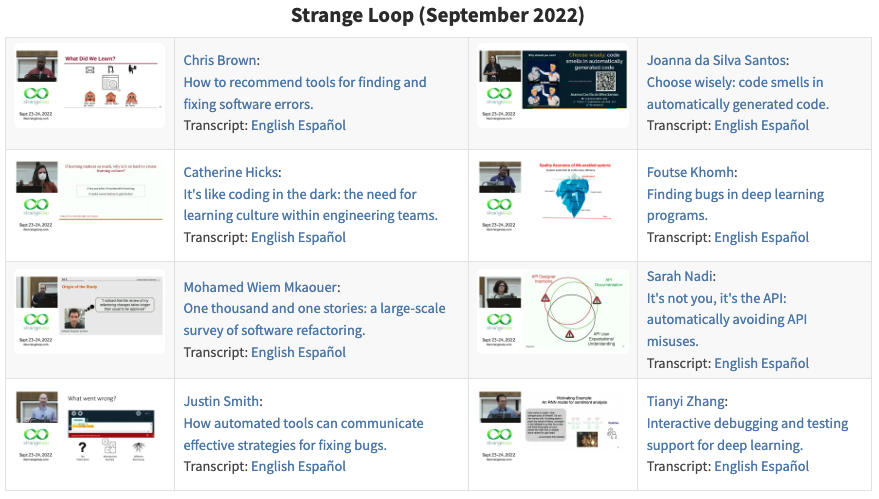

## Once Upon a Time…

-   Book review editor for *[Doctor Dobb's Journal](http://drdobbs.com)*

-   There were hundreds of textbooks on compilers, but none on debuggers or debugging

-   Or build tools, or package managers, or…

---

## Early 2000s

-   Asked to teach a course on software architecture

-   Looked at two dozen books and other people's courses…

-   …but none described actual architectures

-   This, we can fix

  
  
  
  
  

---

## Countervailing Currents

-   Learning should always flow in both directions

-   What do software engineering researchers know that practitioners might care about?

---

## Short and Sweet

-   [It Will Never Work in Theory](https://neverworkintheory.org/) launched in 2011
    -   Brief reviews of research results that might interest practitioners

-     Relaunched in 2021 with reviews and online lightning talks

---

## What Impact Has This Had?

-   None

-   We still don't teach science to CS students

-   So practitioners don't know what they're missing or how to interpret it if they found it

---

## Which Is a Shame

-   [Languages in the C family are as hard to learn as a randomly-designed language](http://dl.acm.org/citation.cfm?id=2534973)

-   [Computer science grades are not bimodal](http://www.cs.toronto.edu/~sme/papers/2016/icer_2016_bimodal.pdf)
    -   I.e., there is no geek gene

-   [Students don't make the mistakes instructors think they make](https://kar.kent.ac.uk/46742/1/fp1187-altadmri.pdf)

-   [No significant difference between test-driven and test-after development](http://people.brunel.ac.uk/~csstmms/FucciEtAl_ESEM2016.pdf)
    -   But there *is* a difference between coarse-grained and fine-grained coding

---

## A Window of Opportunity

-   Data science is rather popular these days…

    -   Students have heard of it

    -   Deans and provosts think it's a Good Thing [tm]

-   *Teach empirical software engineering in disguise*

---

## More Specifically

-   Single-semester course with work done in small teams

    -   Minimize curricular disruption

    -   Still teach workflow, meetings, progress reporting, etc.

-   Build an analysis pipeline for software engineering data

  

  

  <table>
    <tr><td>Requirements analysis</td><td>✓</td></tr>
    <tr><td>Software design</td><td>✓</td></tr>
    <tr><td>Dev Ops</td><td>✓</td></tr>
    <tr><td>Presentation skills</td><td>✓</td></tr>
  </table>
  

  

---

## For Example

> Given the GitHub repositories for six software projects,
> determine whether large PRs take longer to merge than short ones.
	  
-   Requires tool use, model building, and statistical analysis

-   Students *do* science, so they *understand and value* it, so they *engage* with it later

-   And is *culturally defensible*

---

## This Is Also Software Engineering

> 1. People of Asian ancestry are 8% of the Canadian population
>    but 60-75% of undergraduates in Computer Science.
>    Write two one-page papers to argue pro and con that this proves
>    people of European descent are naturally less capable of
>    abstract reasoning than their Asian counterparts.
>
> 2. Compare and contrast your arguments with those made about
>    the under-representation of women in computing.

---

## Practicalities

"You'd like Freedom, Truth, and Justice, wouldn't you, Comrade Sergeant?" said Reg encouragingly.

"I'd like a hard-boiled egg," said Vimes, shaking the match out.

There was some nervous laughter, but Reg looked offended. "In the circumstances, Sergeant, I think we should set our sights a little higher—"

"Well, yes, we could," said Vimes. "But…well, Reg, tomorrow the sun will come up again, and I'm pretty sure that whatever happens we won't have found Freedom, and there won't be a whole lot of Justice, and I'm damn sure we won't have found Truth. But it's just possible that I might get a hard-boiled egg."

— Sir Terry Pratchett, <em>Night Watch</em>

---

## The Way Forward

-   A dozen people (or pairs) contribute one week's material each

    -   Three 50-minute lectures

    -   One set of exercises

-   Preferably recapitulate interesting published results

---

## Prerequisites

-   Assume students have done Data Structures & Algorithms in Python…

-   …know the basics of Git and unit testing…

-   …and vaguely remember what standard deviation means

---

## Publishing

-   [MIT License](https://mit-license.org/) for code samples

-   [Creative Commons – Attribution – Non-Commercial license](https://creativecommons.org/licenses/by-nc/4.0/) for prose

    -   Publisher retains rights to physical copies, PDF, and e-book

    -   HTML version free to read online forever

-   All royalties go to charity

    -   I'm fond of [Books for Africa](https://www.booksforafrica.org/)

---

## Thank You

  

  
<a href="http://third-bit.com">Greg Wilson</a>

  
<a href="mailto:gvwilson@third-bit.com">gvwilson@third-bit.com</a>

  
<a href="http://third-bit.com/talks/ds4se/">http://third-bit.com/talks/ds4se/</a>

