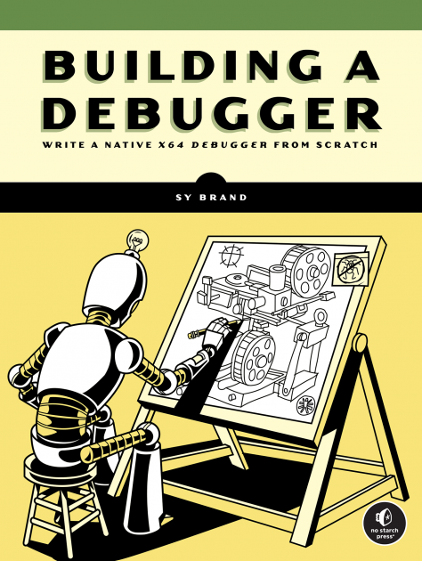
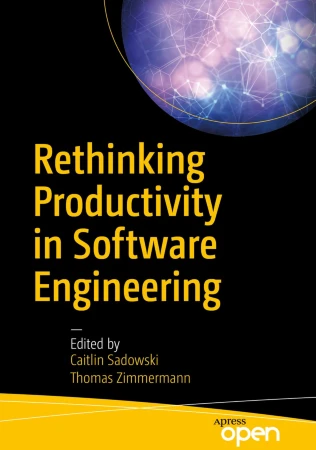

## Abstract

Most people use a to-do list to keep track of things they need to do.
It's just as useful to have a to-don't list of things that would be fun, interesting, and worthwhile,
but that you're not actually going to start because life is short and you're too busy for yet another side project.
This talk describes some of the projects on my to-don't list;
I hope that by explaining why I think they're interesting,
I will help you understand what practitioners actually want from software engineering research
(and computer science more generally).

---

## Who Am I?

-   Software Carpentry (now [The Carpentries](https://carpentries.org))

-   [*Beautiful Code*](https://isbnsearch.org/isbn/9780596510046),
    [*Making Software*](https://isbnsearch.org/isbn/9780596808327),
    and [*The Architecture of Open Source Applications*](https://aosabook.org/)

-   [It Will Never Work in Theory](https://neverworkintheory.org/)

-   [ACM SIGSOFT](https://www.sigsoft.org/)
    [Influential Educator of the Year](https://www2.sigsoft.org/awards/influentialeducator/)

-   Fellow of the [Python Software Foundation](https://www.python.org/psf/)

---

## The Title of This Talk

-   Most people have a to-do list

-   A to-don't list is just as useful

    -   Because life is short and you're busy

-   But other people may be looking for ideas

-   And explaining *why* I want these may help you understand what practitioners actually want from researchers

    -   Because I am really tired of living in
        <a href="https://en.wikipedia.org/wiki/Two_Solitudes_(Canadian_society)">two solitudes</a>

--

> Software engineering research has had as much impact on programmers
> as astronomy has had on stars.

---

## Once Upon a Time…

-   Book review editor for *[Doctor Dobb's Journal](http://drdobbs.com)*

-   Hundreds of textbooks on compilers, but none on debuggers or debugging

    -   Or build tools, or package managers, or…

  

    
  

  

    <ul>
      <li>
        

          So I started publishing descriptions of
          <a href="@root/ideas/not-on-the-shelves/">books that don't exist</a>
        

      </li>
      <li>
Sympathetic magic
</li>
    </ul>
  

---

## A Credible Measure of Productivity

-   We don't know how to measure programmers' productivity

    -   Which makes almost all claims about AI-assisted programming vacuous

-   But almost all of us believe in version control

    -   So strongly that if you find no effect we will believe your methodology is flawed

-   So have several researchers design and run that study independently

    -   Then compare results and combine methods

    -   And apply the method to other problems

--

> It is not enough to be right: you must also be heard.

---

## Tooling Effort Over Time

-   How does the effort devoted to tooling and deployment change as a project grows?

-   (How) has it been changed by the move from desktop applications to cloud-based applications?

-   Does tooling effort level off when a project reaches a certain size?

-   Requires an agreed-upon measure of effort

-   So this study can't usefully be done before the previous one

---

## A WYSIWYG Notebook

-   Computational notebooks are ubiquitous

    -   [Jupyter](https://jupyter.org/) uses JSON

    -   [Marimo](https://marimo.io/) uses Python with embedded strings

    -   [Quarto](https://quarto.org/) Markdown with embedded code

-   Why not use the format (and UI) that the other 99% of our species uses?

-   Build an [extension](https://wiki.documentfoundation.org/Documentation/DevGuide/Extensions)
    for [LibreOffice](https://www.libreoffice.org/)

    -   Create tables, draw diagrams, and be taken seriously

--

> It's OK to be usable.

---

## `diff` Considered Harmful

-   Programmers really like version control

    -   But `diff` only works on punchcards, so we refuse to use richer document formats

-   Is there a Unified Theory of Diff similar to
    <a href="http://dx.doi.org/10.1017/s0956796820000088">Mokhov (2020)</a>
    or <a href="https://doi.org/10.48550/arXiv.2310.04368">Crichton (2023)</a>?

    -   Structural vs. textual differences in code

    -   Diagrams? Databases? Spreadsheets? Multimedia?

---

## Do We Use What We Teach?

-   All undergrad CS programs have a data structures & algorithms course in first or second year

-   What do these courses actually teach?

    -   Mine topics from textbooks and online course notes

-   (How much) are these ideas used in upper-year courses?

    -   I have never used dynamic programming in a 40-year career

--

-   Real question: how well do different topic aggregation methods agree?

---

## Variable Roles

-   Sajaniemi et al found [ten patterns](https://www.ppig.org/files/2005-PPIG-17th-sajaniemi.pdf)
    in the way variables are used in novice programs

    -   "Counter" and "Most Valuable" are design patterns for novices

-   (Can we) use static and dynamic analysis tools to:

    -   See if these patterns are real?

    -   Find others?

-   As with the version control study,
    the real goal is an agreed-on methodology

--

> It's OK to start small.

---

## Calibrated Code Review

-   Give novice programmers a one-page program

-   Have them score it using a checklist

-   Their grade is how well their review matches the instructor's

    -   Start with 100%, lose one mark for each false positive or false negative

-   How quickly do they learn to see code like the instructor?

-   Does this help them write better code?

-   Does this help them use genAI coding assistants more effectively?

---

## Understanding Ethics

-   Repeat the previous exercise for ethics in programming

    -   Create multiple-choice scenarios in which a programmer needs to make an ethical decision

    -   Have experts rank the available answers

    -   See how well students and professionals match those rankings

> Your manager wants you to add an option to a wayfinding application to avoid checkpoints.
> It will allow protestors to avoid police on their way home,
> but it will allow drunk drivers to avoid them as well.
> Should you add it?

--

-   Prediction: professionals will do no better than students

---

## Validity of Popular Claims

-   Are some programmers really ten times more productive than others?

-   Does test-driven development actually make programmers more productive?

-   *Do people actually believe these claims?*

-   Find out by analyzing
    [best](https://isbnsearch.org/isbn/9781953953216)-[selling](https://isbnsearch.org/isbn/9781491973899)
    [books](https://isbnsearch.org/isbn/9789083381824) on
    [software](https://isbnsearch.org/isbn/9798986769318) [engineering](https://isbnsearch.org/isbn/9780137314911)
    to see how many of their claims are valid

-   Then survey programmers to see which (if any) they believe

--

> Programmers know as much about software engineering research
> as stars know about astronomers.

---

## What We Don't Teach

-   Most universities offer an undergrad course on entrepreneurship or the business of software

-   Survey these courses to determine what they *don't* teach

    -   How many devote time to labor rights?

    -   How many discuss anti-trust legislation?

    -   How does the answer vary by country and by the nature of the institution?

---

## What Ties These Together

  

    
  

  

    <ul>
      <li>
We need methods that we agree on…
</li>
      <li>
…that working programmers believe in…
</li>
      <li>
…that let us tackle problems they care about
</li>
    </ul>
  

-   And then we need undergrad courses that teach these methods and results

-   But that's another talk

---

## Thank You

  

  
<a href="http://third-bit.com">Greg Wilson</a>

  
<a href="mailto:gvwilson@third-bit.com">gvwilson@third-bit.com</a>

  
<a href="http://third-bit.com/talks/to-dont/">http://third-bit.com/talks/to-dont/</a>

