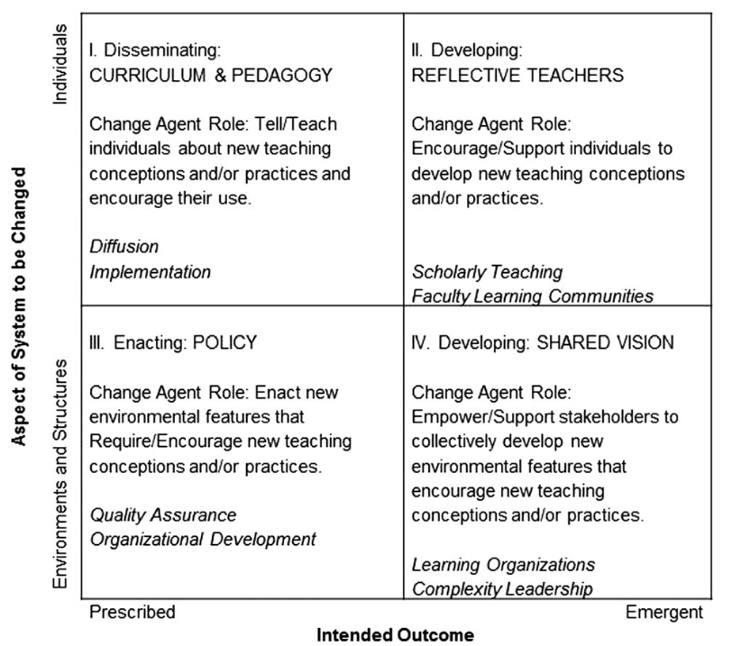

# Marketing
<!--: \label{marketing} :-->

> **Objectives**
>
> * Learners can explain what marketing actually is.
> * Learners can clearly explain the value of what they are offering
>   to different potential stakeholders.
> * Learners can explain what a brand is and determine whether they
>   or their organization have one.

It's hard to get people with technical backgrounds to think about
marketing, not least because it's perceived as being about spin and
misdirection.  In reality, _[marketing](gloss.html#marketing)_ is the
craft of seeing things from other people's perspective, understanding
their wants and needs, and finding ways to meet them.  This should
sound familiar: many of the techniques introduced earlier in this book
are intended to do exactly this for lessons.  This chapter will look
at how to apply similar ideas to the larger problem of getting people
to support the work you're trying to do.

## What Are You Offering to Whom?

The first step is to figure out what you are offering to whom, i.e.,
what actually brings in the funding and other support you need to keep
operating.  As [[Kuchner2011](biblio.html#kuchner-marketing)] points
out, the answer is often counter-intuitive.  For example, most
scientists think their product is papers, but their actual product is
their grant proposals, because those are what brings in money.  Their
papers are the advertising that persuades people to buy (fund) those
proposals, just as albums are now the advertising that persuades
people to buy musicians' concert tickets and t-shirts.

You may or may not be a scientist, so suppose instead that your group
is offering weekend programming workshops to people who are
re-entering the workforce after taking several years out to look after
young children.  If your learners are paying enough for your workshops
to cover your costs, then the learners are your customers and the
workshops are the product.  If, on the other hand, the workshops are
free, or the learners are only paying a token amount (to cut the
no-show rate), then your actual product may be some mix of:

- your grant proposals,
- the alumni of your workshops that the companies sponsoring you would
  like to hire,
- the half page summary of your work in the mayor's annual report to
  city council that shows how she's supporting the local tech sector,
  or
- the personal satisfaction that teaching gives your volunteer
  instructors.

As with our [recommended lesson design process](design.html), you
should try to identify specific people who might be interested in what
you're doing and figure out which of *their* needs *your* program will
meet.  [Personas](lessons.html#learner-personas) are one way to do
this.  Another is to write a set of _[elevator
pitches](gloss.html#elevator-pitch)_, each aimed at a different
stakeholder.  A widely-used template for these pitches looks like
this:

1.  For *target audience*
2.  who *dissatisfaction with what's currently available*
3.  our *category*
4.  provide *key benefit*.
5.  Unlike *alternatives*
6.  our program *key distinguishing feature.*

Continuing with our weekend workshop example,
we might use this for potential attendees:

> For *people re-entering the workforce after taking time out to raise children*
> who *still have regular childcare responsibilities*,
> our *introductory programming workshops*
> provide *weekend classes with on-site childcare*.
> Unlike *online classes*,
> our program *gives participants a chance to meet people who are at the same stage of life*.

<!--: \noindent :-->
but use this to characterize the companies that we would like to
donate staff time for teaching:

> For *a company that wants to recruit entry-level software developers*
> that *is struggling to find mature, diverse candidates*
> our *introductory programming workshops*
> provide *a pool of potential recruits in their thirties that includes large numbers of people from underrepresented groups*.
> Unlike *college recruiting fairs*,
> our program *connects companies directly with a diverse audience*.

If you don't know why different potential stakeholders might be
interested in what you're doing, ask them.  If you do know, ask them
anyway: answers can change over time, and it's a good way to discover
things that you might have missed.  Once you have written these
pitches, you should use them to drive what you put on your
organization's web site and in other publicity material, since it will
help people figure out as quickly as possible whether you and they
have something to talk about.  However, you probably *shouldn't* copy
them verbatim, since many people in tech have seen this template so
often that their eyes will glaze over if they encounter it again.

As you are writing these pitches, remember that people are not just
economic animals.  A sense of accomplishment, control over their own
lives, and being part of a community motivates them just as much as
money.  People may volunteer to teach with you because it's what their
friends are doing; similarly, a company may say that they're
sponsoring classes for economically disadvantaged high school students
because they want a larger pool of potential employees further down
the road, but in reality, the CEO might actually be doing it simply
because it's the right thing to do.

## Branding and Positioning

A _[brand](gloss.html#brand)_ is someone's first reaction to a mention
of a product; if their reaction is "what's that?", you don't have a
brand yet.  Branding is important because people aren't going to help
with something they don't know about or don't care about.

Most discussion of branding today focuses on ways to build awareness
online.  Mailing lists, blogs, and Twitter all give you ways to reach
people, but as the volume of (mis)information steadily increases, the
attention paid to any particular interruption decreases.  As this
happens, _[positioning](gloss.html#positioning)_ becomes more
important.  Positioning (sometimes also called "differentiation") is
what sets your offering apart from others: it's the "unlike" section
of your elevator pitches.  When you are reaching out to people who are
already generally familiar with your field, this is what you should
emphasize, since it's what will catch their attention.

There are other things you can do to help build your brand as well.
One is to use props: a robot car that one of your students made from
scraps she found around the house, the website another student made
for his parents' retirement home, or anything else that makes what
you're doing seem real.  Another is to make a short video–no more than
a few minutes long–showcasing the backgrounds and accomplishments of
your students.  The aim of both is to tell a story: while people
always ask for data, stories are what they believe.

> **Foundational Myths**
>
> One of the most compelling stories a person or organization can tell
> is about why and how they got started.  Are you teaching what you
> wish someone had taught you but didn't?  Was there one particular
> person you wanted to help, and that opened the floodgates?  Are you
> picking up where someone else left off, and if so, why?

Free samples are also compelling.  Put some lesson materials online so
that people can see what you teach; post a few (short) videos from
actual workshops, or go to where your hoped-for learners or sponsors
are and run a lunchtime drop-in session.

Whatever else you do, make your organization findable by doing what
you can to make you and your organization rank highly in Google
searches.  There's a lot of folklore about how to do this under the
label "SEO" (for "search engine optimization"); given Google's
near-monopoly powers and lack of transparency, most of it boils down
to trying to stay one step ahead of algorithms designed to prevent
people from gaming rankings.  Search for yourself and for your
organization on a regular basis and see what comes up, then read
[these guidelines from Moz][moz] and do what you can to improve your
site.  Keep [this cartoon][xkcd-website] in mind: people don't
(initially) want to know about your org chart or get a virtual tour of
your site; they want your address, parking information, and above all,
some idea of what you teach, when you teach it, how to get in touch,
and how it's going to change their life.

Offline findability is equally important for new organizations.  Many
of the people you hope to reach might not be online, or might not be
online as often as you; notice boards in schools, local libraries,
drop-in centers, and grocery stores are still an effective way to
reach them.

> **Build Alliances**
>
> As discussed in the [previous chapter](community.html), building
> alliances with other groups that are doing things related to what
> you're doing pays off in many ways.  One of those is referrals: if
> someone approaches you for help, but would be better served by some
> other organization, take a moment to make an introduction.  If
> you've done this several times, add something to your website to
> help the next person find what they need.  The organizations you are
> helping will soon start to help you in return.

## The Art of the Cold Call

Building a web site and hoping that people find it is one thing;
calling people up or knocking on their door without any sort of prior
introduction is another.  As with standing up and teaching, though,
it's a craft that can be learned like any other, and there are a few
simple rules you can follow:

1. Start by establishing a point of connection: "I was speaking to X"
   or "You attended bootcamp Y". This must be specific: spammers and
   headhunters have trained us all to ignore anything that starts, "I
   recently read your website".

2. Explain how you are going to help make their lives better (e.g.,
   "Your students will be able to do their math homework much faster
   if you let us help them").

3. Be specific about what you are offering (e.g., "Our usual two-day
   curriculum includes...") so that they can figure out right away
   whether this is worth pursuing, but keep it to one or two
   sentences.

4. Mention your backers, your size, how long you've been around, or
   your instructors's backgrounds to make yourself credible.

5. Create a slight sense of urgency ("we're booking workshops right
   now").

6. Tell them what your terms are: do you charge money, do they need to
   cover instructors' travel costs, can they reserve seats for their
   own staff, etc.

7. Above all, *keep it short*. The message below takes 30 seconds or
   less to scan; by the end, either they're interested enough to reply
   or they're not.

This template works pretty well, but "pretty well" is relative.  Most
organizations expect a 2-3% response rate to cold calls; for Software
Carpentry, we found that about half of emails were answered, about
half of those answers were, "Sure, let's talk more," and about half of
those led to workshops, which means that 10-15% of targeted emails to
people we had some sort of connection with turned into workshops.

> **Mail Out of the Blue**
>
> Hi [name],
>
> I hope you don't mind mail out of the blue, but I wanted to follow
> up on our conversation at the tech showcase last week to see if you
> would be interested having us run an instructor training workshop -
> we're scheduling the next batch over the next couple of weeks.
>
> As background, hundreds of grassroots groups are now teaching people
> how to code, but ironically, most of their founders are teaching
> themselves how to teach.  Just as a few lessons about variables,
> loops, and functions can save people hours of frustration, a few
> lessons about formative assessment, live coding, and other practices
> can help busy volunteers do more good in less time and with less
> pain.
>
> This one-day class will introduce participants to a handful of key
> ideas that have a firm foundation in education research and proven
> useful in practice.  The class is based on the Software Carpentry
> instructor training course, which has been delivered dozens of times
> on four continents.  Instructions will be hands-on: short lessons
> will alternate with individual and group practical exercises,
> including practice teaching sessions.
>
> We've run dozens of workshops like this since 2010, and if it sounds
> interesting, please give me a shout.

## Making Change

Everyone is afraid of the unknown and of embarrassing themselves.  As
a result, most people would rather fail than change.  Marketing is
therefore not just about communicating clearly: it is also about
figuring out why people are resisting your offer of help and then
finding a way past that resistance.

For example, Lauren Herckis looked at [why university faculty don't
adopt better teaching methods][herckis].  She found that the main
reason is a fear of looking stupid in front of their students, and
that secondary reasons were concern that the inevitable bumps in
switching how they taught would affect course evaluations, and a
desire to continue emulating the lecturers who had inspired them.
It's pointless to argue about whether these issues are "real" in some
objective sense: faculty believe they are, so any marketing aimed at
faculty needs to address them.

Medical researchers realized several decades ago that there's no point
coming up with a better way to do things if practitioners won't adopt
it.  The growing field of _[implementation
science](gloss.html#implementation-science)_ explores evidence-based
ways to improve transference, and
[[Borrego2014](biblio.html#borrego-henderson-change)] categories some
related ideas for effecting change in higher education.  The bulk of
that paper expands upon this table (which is included as an image
because rotating text in a simple cross-browser fashion is apparently
still beyond present-day technology):

Each of the major categories is defined by whether the change is
individual or to the system as a whole, and whether it is prescribed
(top-down) or emergent (bottom-up).  The person trying to make the
changes–and make them stick–has a different role in each situation,
and should pursue different strategies accordingly.  In our
experience, the most important things are:

1.  *Ask, don't tell.*  Teachers know their students and their
    needs much better than you do, so start by asking what they
    think the most pressing needs are.

2.  *Find allies.* Many colleges and universities have teaching and
    learning centers whose staff are keen to improve teaching
    practices, and who also know how to navigate the local
    bureaucracy.  Similarly, there are often tech meetup groups or
    other local organizations whose members are likely helpers.

3.  *Start small.* [[Lang2016](biblio.html#lang-small-teaching)]
    describes evidence-based teaching practices that can be put in
    place with minimal effort and at low cost.  These may not have the
    most impact, but scoring a few early wins helps build support for
    larger and riskier efforts.

## A Final Thought

As [[Kuchner2011](biblio.html#kuchner-marketing)] says, if you can't
be first in a category, create a new category that you can be first
in; if you can't do that, think about doing something else entirely.
This isn't as defeatist as it sounds: if someone else is already doing
what you're doing better than you, there are probably lots of other
equally useful things you could be doing instead.

## Challenges

### Write an Elevator Pitch for a City Councilor (15 minutes)

This chapter described an organization that offers weekend programming
workshops for people re-entering the workforce after taking a break to
raise children.  Write an elevator pitch for that organization aimed
at a city councilor whose support the organization needs.

### Write Elevator Pitches for Your Organization (30 minutes)

Identify two groups of people your organization needs support from,
and write an elevator pitch aimed at each one.

### Identify Causes of Passive Resistance (30 minutes)

People who don't want change will sometimes say so out loud, but will
also often use various forms of passive resistance, such as just not
getting around to it over and over again, or raising one possible
problem after another to make the change seem riskier and more
expensive than it's actually likely to be.  Working in small groups,
list three or four reasons why people might not want your teaching
initiative to go ahead, and explain what you can do with the time and
resources you have to counteract each.

### Why Teach Programming? (20 minutes)

As [Mark Guzdial has pointed out][guzdial-transfer], just learning
to program doesn't automatically improve people's general
problem-solving skills (i.e., there is no evidence for transference).
However, there are lots of other reasons to learn to program:

1.  To understand our world.
2.  To study and understand processes.
3.  To be able to ask questions about the influences on their lives.
4.  To use an important new form of literacy.
5.  To have a new way to learn science and mathematics.
6.  As a job skill.
7.  To use computers better.
8.  As a medium in which to learn problem-solving.

Read [the full explanations of these points][guzdial-transfer], then
draw a 3x3 grid whose X and Y axes are labelled "low", "medium", and
"high" and place each point in one sector according to how important
it is to you (the X axis) and to your learners (the Y axis).

1.  Which points are closely aligned in importance (i.e., on the
    diagonal in your grid)?
2.  Which points are mis-aligned (i.e., in the off-diagonal corners)?
3.  How does this affect your marketing strategy?

[guzdial-transfer]: https://computinged.wordpress.com/2017/10/18/why-should-we-teach-programming-hint-its-not-to-learn-problem-solving/
[herckis]: https://www.insidehighered.com/news/2017/07/06/anthropologist-studies-why-professors-dont-adopt-innovative-teaching-methods
[impl-sci]: https://implementationscience.biomedcentral.com/
[moz]: https://moz.com/learn/seo/on-page-factors
[xkcd-website]: https://xkcd.com/773/
