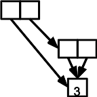

# Teaching Online
<!--: \label{online} :-->

> **Objectives**
>

> * Learner can explain why expectations for massive online courses
>   were unrealistic, and ways in which ad hoc use online learning
>   is changing education.
> * Learners can explain several key features of successful online
>   courses, and judge whether a particular course meets those
>   criteria.
> * Learners can implement several logically different kinds of
>   exercises using multiple-choice questions and/or write-and-run
>   coding.

> *If you use robots to teach, you teach people to be robots.*  
> – variously attributed

Five years ago, you couldn't cross the street on a major university
campus without hearing some talking about how teaching online was
going to revolutionize education–or destroy it, or possibly both.  Now
that the hype has worn off, it's clear that while almost all learning
now has an online component, MOOCs (massive open online courses)
aren't as effective as their more enthusiastic proponents claimed they
would be [[Ubell2017](biblio.html#ubell-moocs)].  As one specific
example, [[Koedinger2015](biblio.html#koedinger-doing-watching)]
estimated "…the learning benefit from extra doing (1 SD increase) to
be more than six times that of extra watching or reading." "Doing", in
this case, refers to completing an interactive task with feedback,
while "benefit" refers to both completion rates and overall
performance.

One reason is that recorded content is ineffective for most novices
learners because it cannot intervene to clear up specific learners'
misconceptions. Some people happen to already have the right
conceptual categories for a subject, or happen to form them correctly
early on; these are the ones who stick with most massive online
courses, but many discussions of the effectiveness of such courses
ignore this survivor bias.

Many enthusiasts also didn't realize that MOOCs and other forms of
online education were just the latest in a long series of proposals to
use machines to teach.  As [Audrey Watters has chronicled][timeline],
every innovation in communications–from the printing press through
radio and television to desktop computers and now mobile devices–has
spawned a wave of aggressive optimists who believe that education is
broken (without actually knowing much about education) and that the
latest technology is the solution (without knowing much about what's
been tried before, why it failed, or what success would actually look
like) [[Watters2014](biblio.html#watters-monsters)].

That said, technology *has* changed teaching and learning.  Before
blackboards were introduced into schools in the early 1800s, there was
no way for a teacher to share an improvised example, diagram, or
exercise with an entire class at once.  Combining low cost, low
maintenance, reliability, ease of use, and flexibility, blackboards
enabled teachers to do things quickly and at scale that they had only
been able to do slowly and piecemeal before.  Similarly, the hand-held
video camera revolutionized athletics training, just as the tape
recorder revolutionized music instruction a decade earlier.

Today's revolutionary technology is the Internet, whose key
characteristics are:

1.  Students can access far more information, far more quickly, than
    ever before–provided, of course, that a search engine considers
    it worth indexing, that their internet service provider and
    government don't block it, and that the truth isn't drowned in a
    sea of attention-sapping disinformation.

2.  Students can access far more people than ever before as
    well–again, provided that they aren't driven offline by harassment
    or marginalized because they don't conform to the social norms of
    whichever group is talking loudest.

3.  Courses can reach far more people than before–but only if those
    students actually have access to the required technology, can
    afford to use it, and aren't being used as a way to redistribute
    wealth from the have-nots to the haves
    [[Cottom2017](biblio.html#cottom-lower-ed)].

4.  Teachers can get far more detailed insight into how students
    work–so long as students are doing things that are amenable to
    large-scale automated analysis and aren't in a position to object
    to the use of surveillance into the classroom.

The caveats in this list are a big part of why this book exists.
Right now, most of the discussion about using technology in teaching
is shaped by what tech can do rather than what students need, and by
Silicon Valley's craving for quick profits rather than by society's
need for competent, well-informed citizens.  If people in tech know
more about teaching, they'll know more about what they should build to
teach more effectively.  And if they do that, they'll be able to reach
more people from more diverse backgrounds, so that there will be more
voices in the room when key decisions about the future of education
are being made.

## General Guidance

MOOCs *are* useful for people who already a mental model and wish to
remind themselves of things they already know or fill in gaps in their
knowledge.  Most of today's online classes use some mix of recorded
video presentations, automated exercise submission and grading, and
web-based discussion, which can either be synchronous using chat tools
and video calls or asynchronous using mailing lists and bulletin
boards.

The two greatest strengths of this model are that learners can work
when it's convenient for them, and that they have access to a wider
range of courses, both because the Internet brings them all next door
and because online courses typically have lower direct and indirect
costs than in-person courses.  The disadvantages are that they have to
shoulder much more of the burden of staying focused, and that the
impersonality of working online can demotivate people and encourage
uncivil behavior.

> **Hybrid Vigor**
>
> The "pure MOOC" model described above is actually only a small
> subset of what could be done:
> [[Brookfield2016](biblio.html#brookfield-discussion)] describes many
> other ways groups can discuss things, only a handful of which have
> ever been implemented online.)  A hybrid approach that has proven
> quite successful is real-time remote instruction, in which the
> learners are co-located at one (or a few) sites, with helpers
> present, while the instructor(s) teaching via online video.

As an instructor teaching online, you should take advantages of the
pros and do what you can to minimize or avoid the cons
[[Nilson2017](biblio.html#nilson-goodson-online),[Miller2016](biblio.html#miller-online)]:

1.  Deadlines should be frequent, well-publicized, and enforced,
    so that learners will get into a work rhythm.

2.  Keep other all-class synchronous activities like live lectures to
    a minimum so that people don't miss things because of scheduling
    conflicts.

3.  Encourage or require students to do some of their work in small
    groups (2-6 people) that *do* have synchronous activities such as
    a weekly online discussion.  This will help students stay engaged
    and motivated without creating too many scheduling headaches.

4.  Create, publicize, and enforce a
    [code of conduct](practices.html#have-a-code-of-conduct)
    so that everyone can actually (as opposed to theoretically) take
    part in online discussions.

5.  Remember that people learn best in [small chunks](memory.html), so
    use lots of small lesson episodes rather than a handful of
    lecture-length chunks.  Also remember that, disabilities aside,
    they can read faster than you can talk, so use video to engage
    rather than instruct.  The one exception to this is that video is
    actually the best way to teach people verbs (actions), so use
    short screencasts to show people how to use an editor, step
    through code in a debugger, and so on.

6.  Remember that [the goal when teaching novices](novice.html) is
    to identify and clear up misconceptions.  If early data shows
    that learners are struggling with some parts of a lesson, create
    extra alternative explanations of those points and extra exercises
    for them to practice on.

7.  Remember that you are not the first person to record educational
    videos: everything from [short guides][adelaide-video] to [entire
    books](biblio.html#spannaus-video) are there to help you.

> **Two-Way Video**
>
> Just as video lets an instructor show learners how she's doing
> things (rather than just what she has done), learners can use it to
> show instructors how they are working.  If you are teaching
> programming using desktop or laptop computers, have your learners
> record a 5-minute screencast to show how they solved a problem.  You
> can then watch that video at 4X or faster to see how proficient they
> are with the tools they're supposed to be using.

<!--: \newpage :-->

> **Freedom To and Freedom From**
>
> Isaiah Berlin's 1958 essay "[Two Concepts of Liberty][berlin]" made
> a distinction between positive liberty, which is the ability to
> actually do something, and negative liberty, which is the absence of
> rules saying that you can't do it.  Unchecked, online discussions
> usually offer negative liberty (nobody's stopping you from saying
> what you think) but not positive liberty (many people can't actually
> be heard).  One way to address this is to introduce some kind of
> *throttling*, such as a rule that says each learner is only allowed
> to contribute one message per discussion thread per day.  Doing this
> allows those who have something to say to say it, while clearing
> space for others to say things as well.

When it comes to teaching platforms, you can either use an all-in-one
learning management system (LMS) such as [Moodle](http://moodle.org)
or assemble something ad hoc: [Slack](http://slack.com) or
[Zulip](https://zulipchat.com/) for chat, [Google
Hangouts](http://hangouts.google.com) for video conversations, and
[WordPress](https://wordpress.org/), [Google
Docs](http://docs.google.com), or any number of wikis for
collaborative authoring.  If you are just starting out, then use
whatever requires the least installation and administration on your
side, and the least extra learning effort on your learners' side.  (I
once taught a half-day class using group text messages because that
was the only tool everyone was already familiar with.)

The most important thing when choosing technology is to *ask your
learners what they are already using*.  Most people don't use
[IRC](https://en.wikipedia.org/wiki/Internet_Relay_Chat), and find its
arcane conventions and interface offputting.  Similarly, while this
book lives in a [GitHub](http://github.com) repository, requiring
non-experts to submit exercises as pull requests proved to be an
unmitigated disaster, even with its supposedly easy-to-use web editing
tools.  As an instructor, you're asking people to learn a lot; the
least you can do in return is learn how to use their preferred tools.

> **Points for Improvement**
>
> One way to demonstrate to learners that they are learning *with*
> you, not just *from* you, is to allow them to edit your course
> notes.  In live courses, we recommend that you enable them to do
> this [as you lecture](practices.html#take-notes-together); in
> online courses, you can put your nodes into a wiki, a
> [GitHub](http://github.com) repository, or anything else so long as
> it allows you to review and comment on their proposed changes, and
> the learner to make revisions based on your feedback, before those
> changes go live.  Giving credit (or at least thanks) to people for
> fixing mistakes, clarifying explanations, adding new examples, and
> writing new exercises does increase the short-term load on the
> instructor, but reduces the lesson's
> [long-term maintenance costs](lessons.html#maintainability).

A major concern with any online community, learning or otherwise, is
how to actually make it a community.  Hundreds of books and
presentations discuss this, but almost all are based on their authors'
personal experiences.  [[Kraut2012](biblio.html#kraut-resnick-online)]
is a welcome exception: while it predates the accelerating decline of
Twitter and Facebook into weaponized abuse and misinformation, most of
what was true then is true now.  [[Fogel2017](biblio.html#fogel-poss)]
is also full of useful tips for the community of practice that
students may hope to join.

One other concern people often have about teaching online is cheating.
Day-to-day dishonesty is no more common in online classes than in
face-to-face settings, but the temptation to have someone else write
the final exam, and the difficulty of checking whether this happened,
is one of the reasons educational institutions have been reluctant to
offer credit for pure online classes.  Remote exam proctoring is
possible, usually by watching the student take the exam using a
webcam.  Before investing in this, read
[[Lang2013](biblio.html#lang-cheating)], which explores why and how
students cheat, and how courses often give them incentives to do so.

## Different Types of Exercises

Every mechanic has her favorite screwdrivers, and every good teacher
has different kinds of exercises to check that her students are
actually learning, let them practice their new skills, and keep them
engaged.  Some types of exercise are well known, but others aren't as
widely used as they should be.

The two key requirements are that an exercise has to be quick for
learners to do, and it has to be possible to check the answer
automatically. These requirements rule out some useful kinds of
assessment, but many remain.

The first type of exercise that works well online is a *multiple
choice question* that presents a question and asks the student to pick
the correct answer from a list.  Doing this might (in fact, should)
require them to do more than just read and remember, and as a previous
post discussed, multiple-choice questions are most effective when
their wrong answers probe for specific misconceptions on the student's
part.

> Example: You are in `/home/marg`.  Use `ls` with an appropriate
> argument to get a listing of the files in the directory
> `/home/marg/seasonal`.  Which of the following files is *not* in
> that directory?
>
> - `autumn.csv`
> - `fall.csv`
> - `spring.csv`
> - `winter.csv`

The second type of exercise is *write and run*, in which the student
has to write code that produces a specified output. When the code is
submitted, we check its structure and/or output and give feedback.
Write and run exercises can be as simple or as complex as the
instructor wants. For example, it's often enough with novices to
simply ask them to call a function or method: experienced instructors
often forget how hard it can be to figure out which parameters go
where.

> Example: the matrix M contains data read from a file. Using one
> function or method call, create a matrix Z that has the same shape
> as M but contains only zeroes.

Write and run exercises help students practice the skills they most
want to learn, but writing good automated checks is hard: students can
find very creative ways to get the right answer, and it's demoralizing
to give them a false negative.  One way to reduce how often this
occurs is to give them a small test suite they can run their code
against before they submit it (at which point it is run against a more
comprehensive set of tests).  Doing this helps to catch cases in which
students have completely misunderstood the written spec of the
exercise.

To help students realize just how hard it is to write good tests
instructors can get them to do it themselves.  Instead of writing code
that satisfies some specification, they can be asked to write tests to
determine whether a piece of code conforms to a spec.

> Example: the function `monotonic_sum` calculates the sum of each
> section of a list of numbers in which the values are monotonically
> increasing. For example, given the input `[1, 3, 3, 4, 5, 1]`, the
> output should be `[4, 3, 9, 1]`. Write and run unit tests to
> determine which of the following bugs the function contains:
>
> - Considers every negative number the start of a new sub-sequence.
> - Does not include the first value of each sub-sequence in the
>   sub-sum.
> - Does not include the last value of each sub-sequence in the
>   sub-sum.
> - Only re-starts the sum when values decrease rather than fail
>   to increase.

*Fill in the blanks* is a refinement of write and run in which the
student is given some starter code and asked to complete it. (In
practice, many write and run exercises are actually fill in the blanks
because the instructor will provide comments to remind the students of
what steps they should take.) Novices often find fill in the blanks
less intimidating than writing all the code from scratch, and since
the instructor has provided most of the answer's structure,
submissions are much easier to check.

> Example: fill in the blanks so that the code below prints the string
> 'hat'.
>
> ```
> text = 'all that it is'
> slice = text[____:____]
> print(slice)
> ```

As described [earlier](load.html), a *Parsons Problem* is another kind
of exercise that avoids the "blank screen of terror" problem: the
student is given the lines of code needed to solve a problem, but has
to put them in the right order.  Research over the past few years has
shown that Parsons Problems are effective because they allow students
to concentrate on control flow separately from vocabulary
[[Ericons2017](biblio.html#ericson-parsons)]. The same research shows
that giving the student more lines than she needs, or asking her to
rearrange some lines and add a few more, makes this kind of problem
significantly harder [[Harms2017](biblio.html#harms-parsons)].
Parsons Problems can be emulated (albeit somewhat clumsily) by asking
students to rearrange code in an editor.

> Example: rearrange and indent these lines to calculate the sums of the
> positive and negative values in a list.
>
> ```
> positive = 0
> return negative, positive
> if v > 0
> else
> positive += v
> negative = 0
> for v in values
> negative += v
> ```

*Tracing execution* is the inverse of a Parsons Problem: given a few
lines of code, the student has to trace the order in which those lines
are executed. This is an essential debugging skill, and is a good way
to solidify students' understanding of loops, conditionals, and the
evaluation order of function and method calls. Again, we don't yet
support this directly, but it can be emulated by having students type
in a list of line labels.

> Example: in what order are the labelled lines in this block of code
> executed?
>
> ```
> A)     vals = [-1, 0, 1]
> B)     inverse_sum = 0
>        try:
>            for v in vals:
> C)             inverse_sum += 1/v
>        except:
> D)         pass
> ```

*Tracing values* is similar to tracing execution, but instead of
spelling out the order in which code is executed, the student is asked
to list the values that one or more variables take on as the program
runs. Again, it can be implemented by having students type in their
answers, but this quickly becomes impractical. In practice, the best
approach is to give the student a table whose columns are labelled
with variable names and whose rows are labelled with line numbers.

> Example: what lines of text pass through the pipes and the final
> redirect when this file:
>
> ```
> 2017-11-01,Akeratu,9
> 2017-11-01,Monona,3
> 2017-11-02,Monona,1
> 2017-11-03,Monona,1
> 2017-11-03,Akeratu,7
> ```
>
> is run through this Unix shell command:
>
> ```
> cut -d , -f 2 filename | sort | uniq > result.txt
> ```

Returning to debugging skills, another exercise that helps student
develop them is *minimal fixes*. Given a few lines of code that
contain a bug, the student must either make or identify the smallest
change that will produce the correct output. Making the change can be
done as using write and run, while identifying it can be done as a
multiple choice question.

> Example: this function is supposed to test whether a point `(x, y)` lies
> strictly within a rectangle defined by `(x_min, y_min, x_max, y_max)`.
> Change one line to make it do so correctly.
>
> ```
> def inside(point, rect):
>     if (point.x <= rect.x_min): return false
>     if (point.y <= rect.y_min): return false
>     if (point.x >= rect.y_max): return false
>     if (point.y >= rect.y_max): return false
>     return true
> ```

*Theme and variation* exercises are similar, but instead of making a
change to fix a bug, the student is asked to make a small alteration
that changes the output in some specific way. These alterations can
include:

-   replacing one function call with another
-   changing one variable's initial value
-   swapping an inner and outer loop
-   changing the order of tests in a chain of conditionals
-   changing the nesting of function calls or the order in which methods
    are chained

Again, this gives students a chance to practice a useful real-world
skill: the fastest way to produce a working program is often to tweak
one that already does something useful.

> Example: change the inner loop control in the function below so that
> it sets the upper left triangle of the matrix to zero.
>
> ```
> def zeroTriangle(matrix):
>     for c in range(matrix.cols):
>         for r in range(matrix.rows):
>             matrix[r, c] = 0
> ```

Matching problems are another entire family of exercises.  *One-to-one
matching* gives the student two lists of equal length and asks her to
pair corresponding items, e.g., "match each piece of code with the
output it produces".

> Example: match each function's name with the operation it implements.
>
> | Function | Operation |
> | -------- | --------- |
> | SGEMV    | triangular banded matrix-vector multiply |
> | STBMV    | solve triangular matrix with multiple right-hand sides |
> | STRSM    | matrix-vector multiply |

*Many-to-many matching* is similar, but the lists aren't the same
length, so some items may be matched to several others. Both kinds
require students to use higher-order thinking skills, but many-to-many
are more difficult because students can't do easy matches first to
reduce their search space.  (In technical terms, there is a higher
[cognitive load](load.html).)

Matching problems can be emulated by having students submit lists of
pairs as text (such as "A3, B1, C2"), but that's clumsy and
error-prone. If available, the machinery built for Parsons Problems
can be used let students drag and drop blocks of text to form matches.

Drag-and-drop opens many other doors: for example, tracing execution
is easy to implement this way. So is *labelling diagrams*: rather than
students typing in the labels, it is faster and more reliable for them
to drag labels around to attach to the correct elements. The picture
can be a complex data structure ("after this code is executed, which
variables point to which parts of this structure?"), the graph that a
program produces ("match each of these pieces of code with the part of
the graph it generated"), the code itself ("match each term to an
example of that program element"), or many other things.

> Example: label the following diagram to show which structures the
> variables `x`, `y`, and `z` refer to after these three lines of code
> are executed.
>
> ```
> x = 3
> y = [x, x]
> z = [x, y]
> ```
>
> 

*Drawing diagrams* of things like data structures is also
straightforward to do on paper but very difficult to grade
automatically. One way to make solutions gradable may be to constrain
the drawing in the same way that Parsons Problems constrain code
construction, i.e., give students the pieces of the diagram and ask
them to arrange them correctly, but this is a long way off.

We mentioned earlier that matching problems require students to use
higher-order thinking skills. *Summarization* also does this, and
gives them a chance to practice a skill that is very useful when
*reporting* bugs rather than fixing them. For example, students can be
asked, "Which sentence best describes how the output of f changes as x
varies from 0 to 10?" and then given several options as a multiple
choice question. Similarly, ranking problems present the student with
several choices and ask them to order them from fastest to slowest,
most robust to most brittle, and so on. (Ranking is more manageable
when implemented with drag and drop than as a multiple choice
question.)

One other kind of exercise that can be implemented as a multiple
choice question is *fault mapping*: given a piece of buggy code and an
error message, the student has to identify the line on which the error
occurred. In simple cases this will be the line mentioned in the error
message, but in more subtle cases, the student will have to trace
execution forward and backward to figure out where things first went
wrong.

Other kinds of exercises are hard for any automated platform to
provide.  *Refactoring exercises* are the complement of theme and
variation exercises: given a working piece of code, the student has to
modify it in some way *without* changing its output. For example, the
student could be asked to replace loops with vectorized expressions,
to simplify the condition in a while loop, etc. The challenge here is
that there are often so many ways to refactor a piece of code that
grading requires human intervention.

> Example: write a single list comprehension that has the same effect
> as this loop.
>
> ```
> result = []
> for v in values:
>     if len(v) > threshold:
>         result.append(v)
> ```

*Code review* is hard to grade automatically in the general case, but
can be tackled if the student is given a rubric (i.e., a list of
faults to look for) and asked to match particular comments against
particular lines of code. For example, the student can be told that
there are two indentation errors and one bad variable name, and asked
to point them out; if she is more advanced, she could be given half a
dozen kinds of remarks she could make about the code without guidance
as to how many of each she should find.  As with tracing values, this
is easiest for students to do when presented as a table, which we
currently don't support.

> Example: using the rubric provided, mark each line of the code below.
>
> ```
> 01)  def addem(f):
> 02)      x1 = open(f).readlines()
> 03)      x2 = [x for x in x1 if x.strip()]
> 04)      changes = 0
> 05)      for v in x2:
> 06)          print('total', total)
> 07)          tot = tot + int(v)
> 08)      print('total')
> ```
>
> 1. poor variable name
> 2. unused variable
> 3. use of undefined variable
> 4. missing values
> 5. fossil code

All of this discussion has assumed that grading must be fully
automatic in order to scale to large classes, but that is not
necessarily true.  [[Paré2008](biblio.html#pare-joordens-peer)] and
[[Kulkarni2013](biblio.html#kulkarni-peer-grading)] report experiments
in which learners grade each other's work, and the grades they assign
are then compared with grades given by graduate-level teaching
assistants or other experts.  Both found that student-assigned grades
agreed with expert-assigned grades as often as the experts' grades
agreed with each other, and that a few simple steps (such as filtering
out obviously unconsidered responses or structuring rubrics) decreased
disagreement even further.  Much more research needs to be done, but
given that critical reading is an effective way to learn, this result
may point to a future in which learners use technology to make
judgments, rather than being judged by technology.

## Challenges

### Give Feedback (20 minutes)

1.  Watch [[Wilson2017](biblio.html#wilson-bad-teaching-recorded)] as
    a group and give feedback on it. Organize feedback along two axes:
    positive vs. negative and content vs. presentation.

2.  Have each person in the class add one point to a 2x2 grid on a
    whiteboard (or in the shared notes) without duplicating any points
    that are already up there.

What did other people see that you missed?  What did they think that
you strongly agree or disagree with?  (You can compare your answers
with [these lists](extras.html#feedback-on-bad-teaching-demo-videos).)

### Adapting Multiple Choices Questions (30 minutes)

Pick one of the examples given in this chapter of using multiple
choice questions to implement some other kind of online programming
exercise, create an example, and swap with one of your fellow
learners.

### Adapting Write and Run Exercises (30 minutes)

Pick one of the examples given in this chapter of using write and runs
exericses to implement some other kind of online programming exercise,
create an example, and swap with one of your fellow learners.

[adelaide-video]: https://www.adelaide.edu.au/learning/teaching/communities-of-practice/elearning/Guide_to_Creating_Educational_Videos.pdf
[berlin]: https://en.wikipedia.org/wiki/Two_Concepts_of_Liberty
[timeline]: http://teachingmachin.es/timeline.html
